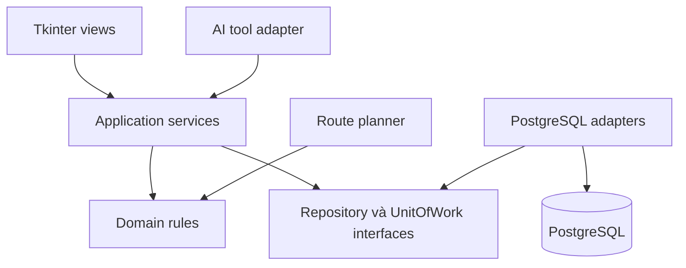

# Warehouse Atlas — Đặc tả đồ án quản lý kho thông minh

**Phiên bản:** 1.0 · **Ngày khảo sát:** 13/09/2026 · **Thời gian thực hiện:** 8 tuần từ ngày khởi động.

**Ràng buộc đã biết:** GUI Tkinter, thiết kế OOP, cơ sở dữ liệu; người chủ trì phụ trách design system và hiểu hệ thống, có đội agent hỗ trợ viết code. Chưa có rubric chính thức, cấu hình máy chạy AI, quy mô nhóm người hoặc số giờ làm mỗi tuần. Vì vậy tài liệu này là một đề xuất kỹ thuật có phạm vi và cổng nghiệm thu, không phải cam kết điểm số.

## 1. Quyết định sản phẩm

Xây một **ứng dụng desktop điều hành kho phân phối hàng đóng gói theo lô**, tên tạm Warehouse Atlas. Ứng dụng phục vụ người nhận hàng, người lấy hàng và quản lý kho. Bài toán xuyên suốt: *nhận đúng → biết hàng ở đâu → giữ đúng hàng cho đơn → xuất đúng lô → giải thích được mọi biến động → phát hiện và xử lý rủi ro*.

Chọn bối cảnh này làm giả định làm việc: hàng tiêu dùng đóng gói, có cả SKU có hạn và không có hạn; một doanh nghiệp, một tiền tệ VND; 1 kho chính, 1 kho phụ; 3 vai trò; 300 SKU cho demo và 2.000 SKU cho thử tải. Đây là quy mô dữ liệu thiết kế, chưa phải số đo hiệu năng.

Giữ lõi desktop độc lập bằng Python. Không dùng toàn bộ ERPNext/Odoo/InvenTree rồi chỉ thay mặt trước bằng Tkinter: phần thiết kế OOP, database và nghiệp vụ của nhóm phải nhìn thấy và bảo vệ được. Các repo là nguồn học thiết kế; bộ schema trong tài liệu do mình đề xuất cho phạm vi này.

**Thông điệp bảo vệ:** “Hệ thống quản lý kho có khả năng truy vết, ngăn cấp phát trùng, lập kế hoạch lấy hàng và giải thích đề xuất bằng dữ liệu thực tế.”

## 2. Kết quả khảo sát năm dự án

Phạm vi khảo sát gồm README/tài liệu chính thức và các tệp model/nghiệp vụ chọn lọc được liệt kê dưới đây; không phải audit toàn bộ năm codebase hoặc benchmark khi chạy chúng. Nhánh master/develop có thể thay đổi; khi đội agent thực sự tham khảo code phải pin commit trong ADR của dự án. Số sao trong ảnh không được dùng làm thước đo độ đúng của mô hình dữ liệu.

### 2.1 InvenTree: học cách mô tả hàng thật

InvenTree phân biệt `Part` với `StockItem`: một SKU có thể xuất hiện ở nhiều vị trí, lô và số lượng; vị trí được tổ chức thành cây. Tài liệu cũng mô tả tracking entry khi hàng thay đổi. Điều này phù hợp trực tiếp với kho của đồ án. [Tài liệu Stock](https://docs.inventree.org/en/stable/stock/).

Trong mã đã đọc, `StockItem` có các thao tác cấp phát, chia hàng, chuyển và kiểm kê; phần merge khóa các hàng theo thứ tự khóa chính. `StockItemTracking` ghi người thực hiện và thông tin biến động. **Điểm cần phân biệt:** lịch sử đối tượng trong InvenTree không đồng nghĩa với sổ chỉ thêm mà Atlas đề xuất; chính đoạn merge có quy tắc riêng về hợp nhất/xóa lịch sử. [Mã Stock](https://github.com/inventree/InvenTree/blob/master/src/backend/InvenTree/stock/models.py), [mã Part](https://github.com/inventree/InvenTree/blob/master/src/backend/InvenTree/part/models.py).

Áp dụng: SKU khác hàng đang nằm tại một ô; mã lô khác mã sản phẩm; chia lượng sang vị trí khác phải bảo toàn tổng lượng. Giới hạn: không làm BOM, lắp ráp, kiểm thử linh kiện và hệ sinh thái plugin trong 8 tuần. Mức phù hợp theo đánh giá của mình: **rất cao cho cách hiểu hàng và vị trí**.

### 2.2 ERPNext: học mối liên hệ chứng từ, sổ kho và số dư

Model `Stock Ledger Entry` có mã hàng, kho, tham chiếu chứng từ, lượng biến động, lượng sau giao dịch và dữ liệu định giá. Model `Bin` chứa các số tổng hợp như actual, reserved, ordered và projected. Hai model giúp phân biệt sự kiện đã xảy ra với số tổng hợp phục vụ vận hành. Lưu ý `Bin` trong ERPNext không nên được dịch máy móc thành “ô kệ vật lý” của Atlas. [Stock Ledger Entry](https://github.com/frappe/erpnext/blob/develop/erpnext/stock/doctype/stock_ledger_entry/stock_ledger_entry.json), [Bin](https://github.com/frappe/erpnext/blob/develop/erpnext/stock/doctype/bin/bin.json).

ERPNext có Stock Reservation gắn đơn bán/pick list; code reservation có validate, submit, cancel và cập nhật số giữ ở các đối tượng liên quan. Đây là nguồn học quy trình hữu ích hơn việc chỉ nhìn ERD. [Tài liệu reservation](https://docs.frappe.io/erpnext/stock-reservation), [mã reservation](https://github.com/frappe/erpnext/blob/develop/erpnext/stock/doctype/stock_reservation_entry/stock_reservation_entry.py).

Áp dụng: chứng từ nháp chưa tác động tồn; ghi sổ trong transaction; bảng số dư có thể đối soát; đơn đặt khác phiếu thực nhập/thực xuất. Atlas chọn đảo bằng bút toán mới và không cho sửa sổ đã ghi. Đây là quyết định thiết kế của Atlas, không khẳng định toàn bộ ERPNext vận hành giống hệt. Giới hạn: không bê kế toán tổng hợp, thuế, đa công ty, sản xuất, landed cost và repost giá vốn theo ngày quá khứ.

### 2.3 Odoo: học độ hạt tồn và quy trình thực hiện

`stock.quant` mô tả lượng theo các chiều như sản phẩm, vị trí, lô, kiện và chủ sở hữu; `stock.move`/`stock.picking` tổ chức việc di chuyển và hoàn tất công việc. Trong code được khảo sát có quản lý reserved quantity, khóa khi cập nhật quant và xử lý backorder khi hoàn tất một phần. [StockQuant](https://github.com/odoo/odoo/blob/19.0/addons/stock/models/stock_quant.py), [StockMove](https://github.com/odoo/odoo/blob/19.0/addons/stock/models/stock_move.py), [StockPicking](https://github.com/odoo/odoo/blob/19.0/addons/stock/models/stock_picking.py).

Phần `product_expiry` của nhánh 19.0 sắp thứ tự FEFO theo `removal_date, in_date, id`. **Removal date của Odoo không phải lúc nào cũng chính là expiry date.** Atlas đơn giản hóa thành hạn dùng trừ yêu cầu thời gian còn lại, và công bố rõ quy tắc đó. [Mã expiry](https://github.com/odoo/odoo/blob/19.0/addons/product_expiry/models/stock_quant.py).

Áp dụng: tồn phải có đủ chiều; phân biệt kế hoạch và thực hiện; giao một phần vẫn giữ phần chưa giao; FEFO quyết định lô trước khi tối ưu đường đi. Giới hạn: không làm consignment/owner, package hierarchy, cross-docking, routing rules tổng quát hoặc toàn bộ mô hình ERP. Mức phù hợp: **rất cao cho tư duy nghiệp vụ, quá rộng để lấy nguyên kiến trúc**.

### 2.4 Medusa: học ranh giới module và giữ hàng

Tài liệu phân biệt `InventoryItem`, `InventoryLevel` và `ReservationItem`; `incoming_quantity` không tự làm tăng lượng đang có hoặc khả năng đáp ứng hiện tại. Model level có ràng buộc duy nhất cho cặp inventory item/location đang hoạt động. [Inventory Concepts](https://docs.medusajs.com/resources/commerce-modules/inventory/concepts), [InventoryLevel](https://github.com/medusajs/medusa/blob/develop/packages/modules/inventory/src/models/inventory-level.ts).

Áp dụng: catalog, inventory và order có trách nhiệm riêng; lượng giữ có đối tượng riêng gắn yêu cầu; mọi công cụ AI gọi use case có hợp đồng. Giới hạn: mô hình tồn phục vụ commerce ở các tệp đã đọc chưa đủ cho nhu cầu lô/hạn/trạng thái/ô kệ của Atlas; không lấy thanh toán, storefront và hạ tầng commerce vào đồ án. [InventoryItem](https://github.com/medusajs/medusa/blob/develop/packages/modules/inventory/src/models/inventory-item.ts), [ReservationItem](https://github.com/medusajs/medusa/blob/develop/packages/modules/inventory/src/models/reservation-item.ts).

### 2.5 Grocy: học tốc độ thao tác và tính hữu dụng

Grocy nhấn mạnh theo dõi thực phẩm/đồ gia dụng, giao diện sẵn sàng cho barcode, mức tồn tối thiểu và hàng sắp đến hạn. [Website chính thức](https://grocy.info/).

`StockService.php` chứa nhận, tiêu thụ, kiểm kê, chuyển và undo; chuyển hàng kiểm tra lượng tại vị trí nguồn, rồi xử lý từng stock entry. Đây là ví dụ dễ đọc để theo dấu một use case, nhưng một service lớn không phải mẫu nên sao chép nguyên cho mục tiêu OOP của đồ án. [StockService](https://github.com/grocy/grocy/blob/master/services/StockService.php).

Áp dụng: màn thao tác quét phải nhanh, focus đúng, thông báo rõ SKU/lô/vị trí và lượng trước–sau. Giới hạn: không làm công thức nấu ăn, meal planning, công việc gia đình. Mức phù hợp: **cao cho UX thao tác kho; thấp hơn cho nền tảng WMS doanh nghiệp**.

### 2.6 Bản đồ quyết định

| Câu hỏi thiết kế | Nguồn học chính | Quyết định cho Atlas |
|---|---|---|
| SKU khác hàng vật lý thế nào? | InvenTree | Product + lot + location + condition |
| Vì sao số tồn hiện tại là X? | ERPNext | Chứng từ → movement → balance, có đối soát |
| Hàng còn nhưng không được xuất? | Odoo, Medusa | Reservation và bộ lọc đủ điều kiện xuất |
| Người dùng làm việc nhanh ra sao? | Grocy | Quét mã, bàn phím, thông báo có ngữ cảnh |
| OOP chia theo đâu? | Đánh giá của mình từ các model | Use case nghiệp vụ và các policy thay thế được |
| Nguồn nào quyết định toàn bộ kiến trúc? | Không có | Kiến trúc gọn theo giới hạn của đồ án |

## 3. Phạm vi và thứ tự ưu tiên

### P0 — phải hoàn thành cuối tuần 4

- Đăng nhập, 3 vai trò, policy quyền ở application service.
- Danh mục SKU, đơn vị, quy đổi theo SKU, barcode, đối tác, cây vị trí.
- Nhập theo lô và nhận một phần từ PO; đơn bán, giữ hàng, xuất một phần.
- Chuyển vị trí, đổi trạng thái GOOD/QUARANTINE/DAMAGED.
- Sổ kho, số dư, chống tồn âm, chống ghi phiếu hai lần, đối soát.
- FEFO/FIFO có giải thích; chặn lô hết hạn hoặc bị block.
- Kiểm kê mù tại một ô, xét chênh lệch, điều chỉnh có lý do.
- Trả hàng có tham chiếu gốc; nghiệp vụ đảo có điều kiện.
- Tìm kiếm, lọc, phân trang; dashboard xuất phát từ truy vấn thật; xuất CSV.
- Seed dữ liệu cố định, backup/restore thử được, bộ kiểm thử nghiệp vụ.

### P1 — phần tạo ấn tượng, tuần 5–6

1. **Sơ đồ kho 2D và đường lấy hàng.** Tkinter Canvas cho phép chọn ô, xem SKU/lô và lập đường đi theo đơn. FEFO chọn hàng trước; thuật toán đồ thị tính đường sau. Có đường baseline để đối chiếu, có tình huống lối đi bị chặn.
2. **Truy vết và thu hồi lô.** Nhập mã lô nhà sản xuất → thấy tất cả lô nội bộ liên quan, hàng còn, ô chứa, phiếu đã xuất, khách/đơn bị ảnh hưởng. Block lô làm lượng được phép cấp phát giảm ngay. Có chế độ xem lại tồn vật lý ở mốc thời gian.
3. **Trợ lý kho có evidence.** Hỏi tiếng Việt → tool đọc dữ liệu → câu trả lời kèm SKU, số phiếu, số liệu và thời điểm → đề xuất PO nháp. Người dùng xem và duyệt trong ứng dụng; use case tính lại trước khi áp dụng.

### P2 — chỉ mở khi cổng cuối tuần 6 đã đạt

What-if nhu cầu tăng 30%, nhà cung cấp trễ 3 ngày; gợi ý mua theo min/max hoặc dự báo đơn giản đã so với baseline. Có thể thay bằng polish trải nghiệm/hiệu năng nếu cần. **Cắt P2 trước khi cắt kiểm thử và luyện bảo vệ.**

Ngoài phạm vi v1: kế toán tài chính đầy đủ, công nợ, thuế, bán hàng online, app mobile, multi-tenant, đồng bộ offline nhiều máy, microservices, chatbot RAG với vector DB khi chưa cần, nhận dạng mọi sản phẩm bằng camera, robot/3D, huấn luyện LLM, quản lý serial từng chiếc, BOM/lắp ráp. Đây là ranh giới sản phẩm đề xuất để bảo đảm độ sâu trong 8 tuần.

## 4. Kiến trúc OOP

Ứng dụng dạng modular monolith: một codebase Python, các module có ranh giới rõ, PostgreSQL riêng. Trong demo một máy, GUI và application services ở cùng process; hai process Tkinter có thể cùng dùng DB để thử cạnh tranh. Nếu triển khai thật nhiều máy ngoài môi trường tin cậy thì cần service API tập trung; đó là kiến trúc khác, không nằm trong v1.

| Tầng/module | Trách nhiệm | Không được làm |
|---|---|---|
| presentation | Tkinter/ttk widgets, view model, điều hướng, định dạng, xử lý sự kiện | Chạy SQL hoặc sửa ORM entity trực tiếp |
| application | ReceiveStock, ReserveOrder, PostShipment, TransferStock, FinalizeStocktake, BlockLot | Nhúng widget hoặc gọi LLM giữa transaction kho |
| domain | Quantity, LotEligibility, FEFO/FIFO, Reservation, các điều kiện bất biến | Import Tkinter, SQLAlchemy hoặc SDK model |
| infrastructure | SQLAlchemy repository, UnitOfWork, PostgreSQL, Clock, scanner, Ollama adapter | Tự quyết định nghiệp vụ xuất hàng |
| intelligence | Tool registry, rule analysis, proposal, route planner | Ghi số dư bằng đường riêng |

Mũi tên từ adapter đến interface biểu diễn adapter triển khai hợp đồng; data flow thực tế đi qua lời gọi của application service. Không biến diagram này thành hạ tầng microservices.

### Lớp và hợp đồng chính

| Interface/lớp | Phương thức đại diện | Vì sao tồn tại |
|---|---|---|
| `InventoryService` | `post_document(command, actor)` | Một cửa ghi sổ cho UI, import và công cụ khác |
| `ReservationService` | `reserve(order_id)`, `release(id, qty)` | Kiểm soát lượng giữ và cạnh tranh |
| `StocktakeService` | `start(location_id)`, `finalize(count_id)` | Đóng băng ô, chênh lệch và duyệt |
| `TraceabilityService` | `trace_lot(code)`, `block_lots(ids, reason)` | Hợp nhất dòng đời và tác động thu hồi |
| `AllocationPolicy` | `allocate(candidates, requested_qty)` | FEFO và FIFO cùng hợp đồng, thay thế được |
| `RoutePlanner` | `plan(graph, stops)` | Tách đường đi khỏi lựa chọn lô |
| `InventoryRepository` | `lock_buckets(keys)`, `append_movement(...)` | Che chi tiết lưu trữ khỏi nghiệp vụ |
| `UnitOfWork` | `begin/commit/rollback` | Một use case = một transaction |
| `Clock` | `now()`, `business_date(timezone)` | Test hạn dùng mà không đổi đồng hồ máy |
| `LLMClient` | `generate(messages, tools)` | Có Ollama adapter và adapter giả dùng riêng trong test |
| `InventoryViewModel` | `load_page(filter, cursor)` | Chuyển DTO thành trạng thái view, không chứa SQL |

Không tạo hệ kế thừa sâu kiểu Product→Food→Drink→Milk chỉ để thể hiện OOP. Dùng composition; FEFO/FIFO là ví dụ đa hình thực sự. Các entity có hành vi/quy tắc và invariant; ORM entity lưu trữ không mặc nhiên thay thế domain model.

### GUI không được treo

Các tác vụ DB, lập route và AI chạy qua worker có giới hạn. Worker trả DTO vào queue; main Tk thread đọc queue bằng `after()` để cập nhật widget. Không dùng một SQLAlchemy Session chung giữa threads hoặc hai thao tác. Tài liệu Python mô tả event loop/threading model của Tkinter; SQLAlchemy yêu cầu quản lý Session theo từng luồng/tác vụ phù hợp. [Tkinter](https://docs.python.org/3/library/tkinter.html#threading-model), [SQLAlchemy Session](https://docs.sqlalchemy.org/en/20/orm/session_basics.html).

Khi người dùng đổi màn: gắn request token để bỏ kết quả đã cũ. Nút ghi sổ có trạng thái đang xử lý, nhưng cơ chế chống trùng phải ở DB/service. AI timeout không được làm giao dịch kho dang dở. Nếu người dùng đóng cửa sổ sau commit, mở lại phải đọc được phiếu thành công.

### Stack đề xuất

Python + Tkinter/ttk + PostgreSQL 16 trở lên + SQLAlchemy 2.x + Alembic. Có thể dùng ttkbootstrap làm lớp theme sau khi kiểm tra trên máy Linux; đây là lựa chọn bổ sung, không phải yêu cầu của kiến trúc. Dùng Canvas cho bản đồ; công cụ vẽ biểu đồ chỉ cần khi dashboard thực sự có thông tin cần biểu diễn. Dependency cụ thể được pin sau spike tuần 1, không dùng nhãn “latest” trong file cài đặt.

## 5. Design system do bạn làm chủ

### Quy tắc thị giác

Giao diện desktop sáng, ưu tiên số liệu: nền `#F5F7FA`, surface `#FFFFFF`, chữ `#172B4D`, màu hành động `#2457D6`; semantic success `#18794E`, warning `#9A6700`, danger `#B42318`. Đây là token đề xuất mới cho UI, không ràng buộc theo mẫu tài liệu học thuật Kien Blue. Trạng thái phải có chữ, không chỉ dựa vào màu.

Spacing 4/8/12/16/24/32; typography 11–12pt body, 16pt tiêu đề màn, 22–24pt số KPI; font hệ thống có đủ dấu tiếng Việt. Dùng named font của Tk, tôn trọng DPI. Row cao khoảng 32–36px sau khi thử 100%/125% trên Linux. Thiết kế tối thiểu ở 1366×768, ưu tiên 1440×900; bảng được cuộn ngang và cột quan trọng giữ dễ đọc.

### Component phải có đủ trạng thái

`AppShell`, `PageHeader`, `FilterBar`, `DataTable`, `StatusBadge`, `QuantityInput`, `BarcodeInput`, `DocumentEditor`, `SidePanel`, `ConfirmDialog`, `Toast`, `EmptyState`, `ErrorState`, `LoadingState`, `EvidenceCard`, `WarehouseMap`.

Đặc tả từng component cần: kích thước, màu, font, focus/hover/disabled/loading/error; ví dụ số liệu dài; quy tắc bàn phím; validation; dữ liệu rỗng; mạng DB lỗi. Không chỉ vẽ ảnh trạng thái đẹp nhất.

### Màn hình và câu hỏi người dùng cần trả lời

| Màn | Câu hỏi | Nội dung/CTA trọng tâm |
|---|---|---|
| Tổng quan | Hôm nay cần xử lý gì? | Đơn thiếu hàng, lô sắp hết hạn, phiếu chờ duyệt; click tới danh sách lọc |
| Tồn kho | Còn bao nhiêu và dùng được bao nhiêu? | SKU, kho/ô, lô, hạn, on hand/reserved/available |
| Nhận hàng | Hàng thực nhận có khớp đơn? | PO còn lại, quét SKU, lô/hạn/giá, số nhận, xem tác động trước ghi |
| Xuất hàng | Đơn đã giữ đúng hàng chưa? | Hàng đủ/thiếu, lô được chọn và lý do, checklist, giao một phần |
| Sơ đồ kho | Đi lấy hàng thế nào? | Ô hàng, lối đi, điểm lấy, baseline và đề xuất |
| Truy vết lô | Lô này còn ở đâu và đã đi đâu? | Timeline, nhập/chuyển/xuất/trả, khách bị ảnh hưởng, block có lý do |
| Kiểm kê | Thực tế lệch bao nhiêu? | Đếm mù, đếm lại, chênh lệch, người duyệt |
| Trợ lý | Vì sao và nên làm gì? | Số liệu, evidence, thời điểm, đề xuất và nút tạo nháp |

Phím tắt đề xuất: Ctrl+K tìm toàn cục, Ctrl+N tạo phiếu theo màn, Enter xác nhận quét, Escape đóng panel. Không dùng Enter mặc định để ghi sổ khi người dùng đang quét mã. Xác nhận ghi sổ phải nêu số dòng, SKU, tổng lượng theo từng đơn vị, kho nguồn/đích. Không cộng chai và kg thành một “tổng số lượng” vô nghĩa.

## 6. Ba tính năng nổi bật được thiết kế như thế nào?

### 6.1 FEFO + đường lấy hàng có đối chứng

Bước 1: lấy các bucket đủ điều kiện, không hết hạn, không block, trạng thái GOOD, vị trí STORAGE. Bước 2: cấp phát theo expiry tăng dần, rồi received_at, rồi id; SKU không theo hạn dùng FIFO. Bước 3: sau khi giữ hàng thành công, dựng các điểm phải ghé. Bước 4: shortest path trên đồ thị lối đi; thứ tự ghé dùng nearest-neighbor rồi 2-opt nếu có thời gian. Tổng thể là heuristic cho nhiều điểm, **không tuyên bố tối ưu toàn cục**.

Baseline: cùng tập reservation và điểm đầu/cuối, ghé điểm theo thứ tự dòng đơn. Đề xuất: cùng điều kiện nhưng đổi thứ tự ghé. Đo tổng mét và thời gian tính; phần trăm giảm = `(baseline − proposed) / baseline × 100%`, chỉ tính khi baseline > 0. Nếu heuristic xấu hơn baseline, giữ baseline. Nếu cạnh bị chặn làm một điểm không thể tới, báo “không có đường”; không vẽ đoạn cắt xuyên qua kệ.

Mục tiêu demo: 20 đơn có ít nhất 4 điểm lấy; công bố median quãng đường thay đổi và 2 ví dụ không cải thiện. Không ghi trước “giảm 40%” khi chưa đo. Tọa độ/chiều dài cạnh là dữ liệu mô phỏng của kho demo, phải ghi rõ trong báo cáo.

### 6.2 Truy vết, thu hồi và xem lại tồn

Nhà cung cấp thông báo mã lô MFG-042 có vấn đề. Tìm theo `(SKU, mã lô nhà sản xuất)` để bắt tất cả lot nội bộ nhận qua nhiều đợt. Hiển thị lượng còn trong từng kho, đơn/khách đã nhận, lượng đã trả về và reservation đang bị ảnh hưởng.

Block lô trong transaction; allocation và shipment đều kiểm lại trạng thái lô. Hàng còn vẫn nằm trong tồn vật lý, nhưng không còn được cấp phát. Reservation đã có được hiển thị cần xử lý; thao tác release/reallocate thực hiện rõ ràng, có event. Không “xóa tồn” vì có lệnh thu hồi.

Xem lại tồn ở T lấy tổng chân biến động có `recorded_at <= T`. Chế độ này chỉ tái dựng **lượng tồn đã được hệ thống ghi nhận**, không hứa tái dựng mọi nhãn/tên/quyền/available trong quá khứ. Muốn biết available lịch sử còn phải có lịch sử block, điều kiện hạn và reservation; đó là mở rộng khác.

### 6.3 Trợ lý có dữ liệu chứng minh

Phạm vi 6 tool: `get_stock`, `trace_lot`, `list_expiry_risks`, `get_order_shortages`, `compute_replenishment`, `propose_purchase_order`. Chỉ tool cuối tạo proposal; thao tác áp dụng proposal gọi use case riêng sau người dùng duyệt. Model không có quyền SQL tùy ý, quyền shell hay credential DB.

Mỗi kết quả tool gồm dữ liệu, đơn vị, `as_of`, ID đối tượng liên quan và giới hạn lọc. Câu trả lời phải dùng các con số từ tool. Một SKU có nhiều kết quả tên gần giống thì hỏi chọn; dữ liệu không đủ thì nói thiếu gì. Tool output là dữ liệu, không được biến nội dung note của nhà cung cấp thành chỉ dẫn hệ thống.

Ollama hỗ trợ tool calling; tuy nhiên model có phù hợp phần cứng và tuân thủ schema tốt hay không phải đo bằng bộ câu hỏi của đồ án. [Tài liệu Ollama](https://docs.ollama.com/capabilities/tool-calling).

Chọn model sau benchmark trên máy thật: 20–30 câu tiếng Việt, trích đúng mã SKU, đúng tool, đúng số; đo p50/p95 latency, RAM/VRAM và lỗi. Chưa có cấu hình máy nên không chốt dung lượng model hoặc tốc độ. Có thể demo core hoàn toàn offline với DB local; AI local cần tải và kiểm tra model trước buổi bảo vệ. Khi AI lỗi, các chức năng gốc và rule-based replenishment vẫn dùng được. Transcript đã lưu chỉ dùng làm minh chứng dự phòng, phải ghi rõ là lần chạy trước.

### What-if bổ sung, nếu đủ thời gian

Bản đầu dùng mô hình giải thích được: `inventory_position = eligible_on_hand + inbound_confirmed − open_order_demand`. `open_order_demand` đã gồm phần reserved; không trừ reserved thêm lần nữa. Khi dưới min, đề xuất tới target, áp dụng MOQ/bội số đặt theo supplier_product. PO overdue được tách rõ, không coi hàng trễ là chắc chắn nhận đúng ngày.

Nếu làm dự báo, chỉ thử seasonal-naive (nếu đủ chu kỳ) và moving average/ETS đơn giản; dùng rolling-origin backtest, không chia ngẫu nhiên chuỗi thời gian. Đánh giá MAE và bias; thêm WAPE khi tổng nhu cầu khác 0; không dùng MAPE khi thường có số 0. Lượng xuất bị thiếu hàng không bằng nhu cầu thật: lấy nhu cầu đơn, xác định hủy/đóng thiếu rõ ràng. Dataset tổng hợp chỉ chứng minh luồng và khả năng chạy, không chứng minh độ chính xác ngoài thực tế.

## 7. Kế hoạch 8 tuần và cổng nghiệm thu

Giả định bạn dành khoảng 15–20 giờ/tuần cho thiết kế, xem demo, kiểm chứng và học hệ thống; con số này là tải công việc đề xuất, không phải thông tin đã biết về lịch của bạn. Agent có thể giảm thời gian viết mã nhưng phần tích hợp và xác nhận nghiệp vụ vẫn cần người chịu trách nhiệm. Lịch bên dưới bắt đầu từ ngày nhóm thực sự khởi động, không gắn sẵn ngày nộp.

| Tuần | Đầu ra đội code | Việc bạn trực tiếp làm | Cổng chuyển tuần |
|---|---|---|---|
| 1 | Repo, migrations đầu, app shell, spike quét mã/Canvas/DB; một lát cắt nhập→tồn | Chốt glossary, 6 use case, ERD; tokens và 3 màn chính; giải thích độ hạt tồn | Tạo SKU, nhận 10, hiện đúng 10; traceback tới phiếu |
| 2 | Ledger, balance, UnitOfWork, posting, transfer, reversal có điều kiện, đối soát | Đọc sequence nhập/chuyển; tự tính tay 5 giao dịch; review states của phiếu | Rollback giữ toàn vẹn; chuyển 3 không làm đổi tổng kho; retry không ghi trùng |
| 3 | PO/SO, partial receipt/shipment, reservation, FEFO; quyền | Review màn nhận/xuất/đơn thiếu; hiểu on hand/reserved/available | Hai phiên tranh 10 món không xuất tổng >10; không xuất lô bị cấm |
| 4 | Kiểm kê, trả hàng, audit, tìm/lọc/phân trang, backup/restore | Tự điều hành trọn ca kho trên app; kiểm các trạng thái lỗi | P0 xanh; chứng minh sổ=balance; khôi phục được dataset demo |
| 5 | Sơ đồ 2D, route baseline/heuristic; lot trace/block; replay lượng | Thiết kế map/trace/evidence; hiểu tại sao FEFO trước route | Chặn lối đi tính lại đúng; recall tìm đủ dòng liên quan |
| 6 | Ollama/tool adapter, evidence, proposal→PO nháp, bộ eval AI | Viết câu hỏi thật; xem mọi con số có nguồn; thử câu mơ hồ | AI dùng đúng tool hoặc từ chối rõ; proposal cũ bị phát hiện; app không treo |
| 7 | Sửa lỗi tích hợp, thử tải, đóng gói; what-if nếu P1 ổn | Freeze scope; review script demo; luyện giải thích DB/OOP | Dataset lớn trong mức mục tiêu; cài trên máy bảo vệ; không lỗi blocker |
| 8 | Release candidate, seed/backup cuối, tài liệu cài, video dự phòng | 3 lần demo trọn vẹn; hỏi đáp bất ngờ; mỗi thành viên giải thích phần mình | Demo liên tục 3 lần; dữ liệu nhất quán; người trình bày hiểu logic |

**Quy tắc hạ phạm vi:** cuối tuần 2 chưa có ledger/transaction đúng → bỏ dự báo; cuối tuần 4 P0 chưa xanh → tuần 5 ưu tiên sửa, route chỉ cần một đơn; cuối tuần 6 AI không ổn → giới hạn tool đọc + đề xuất từ rule, giữ demo map/trace. Không đánh đổi correctness để đủ danh sách tính năng.

## 8. Hợp đồng làm việc với đội agent

Bạn làm Product Owner và người chấp nhận đầu ra. Đội có các vai trò logic: domain/database, application services, GUI/design implementation, intelligence, QA/integration. Đây là phân công đề xuất cho đội của bạn, không phải danh sách agent đã được chạy trong phiên nghiên cứu này.

Mỗi task cần có: mục tiêu người dùng, màn/use case bị tác động, bảng được ghi, invariant phải giữ, hợp đồng input/output, lỗi dự kiến, test chấp nhận và phần ngoài phạm vi. Agent không được tự thêm bảng hoặc đổi enum/state dùng chung khi chưa cập nhật ADR và migration.

| Nhóm task | Phụ thuộc | Điều kiện giao nhận |
|---|---|---|
| DB-01 schema core + migrations | Glossary/ERD đã chốt | Chạy DB trống, FK/CHECK/rollback đúng; downgrade có kế hoạch |
| INV-01 posting + ledger/balance | DB-01 | Một transaction; idempotency; đối soát sau từng thao tác |
| INV-02 reservation/FEFO | INV-01 + SO | Không giữ vượt; đơn vị chuẩn; test tranh hàng |
| GUI-01 components/app shell | Tokens/màn mẫu | Các state và bàn phím; dùng DTO giả trước khi tích hợp |
| GUI-02 workflows | Services contract | Không import repository/SQLAlchemy ở presentation |
| CTRL-01 stocktake/returns | INV-01/02 | Freeze location, phần lượng trả hợp lệ, không phá reservation |
| MAP-01 route | Reservation + map schema | Baseline cùng input; không đi xuyên vật cản |
| AI-01 tools/proposals | Services read + rules | Bằng chứng; không SQL tùy ý; áp dụng qua use case có kiểm lại |
| QA-01 release | Các feature đã merge | Chạy acceptance pack, cài/restore và demo từ dataset cố định |

Ví dụ task tốt:

> Triển khai PostShipment cho đơn đã confirmed. Nhận document_id, expected_version, idempotency_key, actor. Khóa theo chuẩn ở đặc tả DB; kiểm lot, location freeze, quyền và reservation thuộc đúng SO line. Ghi movement, giảm on_hand và reserved, tăng consumed, tạo reservation_event, đổi phiếu POSTED trong cùng transaction. Test hai process xuất số hàng cuối, retry key giống/khác payload, lot block sau lúc tạo nháp. Không làm màn GUI trong task này.

Merge theo vertical slice mỗi 1–2 ngày, không chờ mỗi agent viết xong toàn module rồi mới ghép. Mỗi PR có ảnh/demo nếu sửa GUI, migration nếu sửa DB, bằng chứng test nghiệp vụ nếu sửa tồn. Chỉ một người/agent chịu trách nhiệm phiên bản migration và hợp đồng dùng chung tại một thời điểm.

## 9. Điều bạn cần hiểu để bảo vệ

Không cần thuộc tất cả dòng mã, nhưng bạn phải tự giải thích và dự đoán kết quả của các tình huống này:

1. Vì sao `product.quantity` không đủ? Nêu được cùng SKU ở hai ô, hai lô và hai trạng thái.
2. Phiếu nháp, đơn đã xác nhận, reservation và movement khác nhau ở thời điểm nào?
3. Hai người cùng thấy còn 10 rồi mỗi người xuất 7: transaction và khóa chặn ra sao?
4. Vì sao sửa số dư trực tiếp làm mất khả năng giải thích? Rebuild và reversal làm gì?
5. GUI gọi InventoryService thế nào, và vì sao domain không import Tkinter?
6. FEFO/FIFO thể hiện đa hình gì? Route heuristic có giới hạn gì?
7. Model AI đọc dữ liệu từ đâu; chỗ nào dùng tính toán xác định; đề xuất sai có thể đi vào DB bằng đường nào?
8. Một số đẹp trên dashboard được tính từ bảng nào, có double count reservation không?
9. Trả hàng khác đảo chứng từ thế nào? Hàng hết hạn có còn nằm trong tồn vật lý không?
10. Dataset giả chứng minh được gì và chưa chứng minh được gì?

Mỗi tuần tự vẽ một sequence diagram và tự tính bằng tay một ca kho trước khi xem ứng dụng. Nếu không tự dự đoán được kết quả, chưa duyệt PR chỉ vì màn hình chạy.

## 10. Các quyết định cần chốt trong tuần 1

Dùng giả định trong tài liệu để khởi động ngay, sau đó xác nhận: rubric/những thư viện GUI được phép; loại hàng thực tế nhóm chọn; cấu hình máy demo; số thành viên và quỹ giờ; giảng viên có yêu cầu SQL thuần thay ORM ở phần nào; khả năng dùng PostgreSQL trong phòng bảo vệ. Nếu không có yêu cầu khác, tiếp tục phương án hiện tại.

Chi tiết bảng/cột, quy tắc giao dịch, truy vấn, acceptance test và kịch bản demo nằm trong `02_database.md` và `06_demo_nghiem_thu.md`. SQL là baseline cấu trúc để agent bắt đầu; không được xem việc chạy migration thành công là đã có engine quản lý kho hoàn chỉnh.
