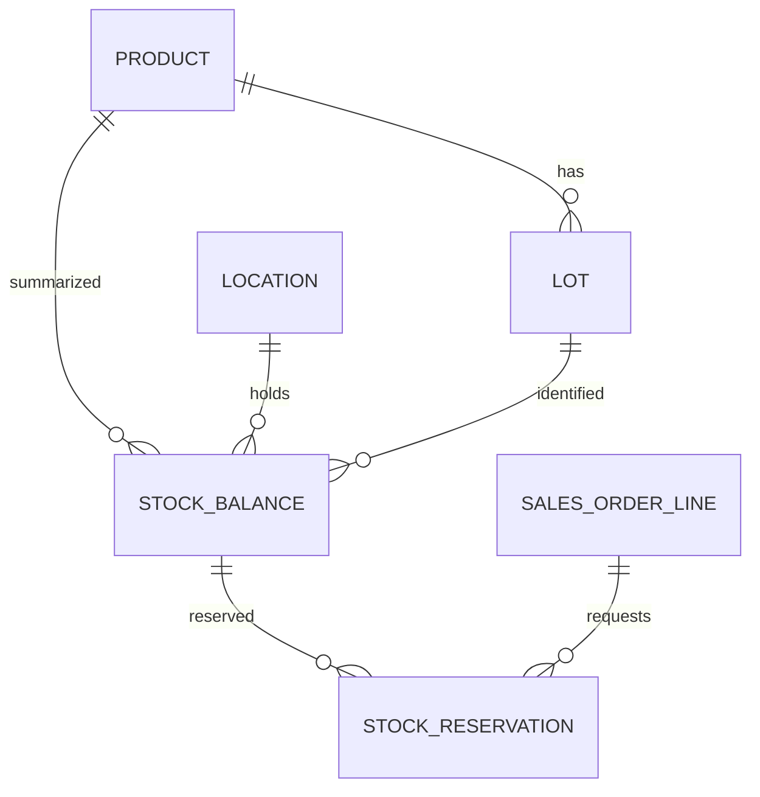
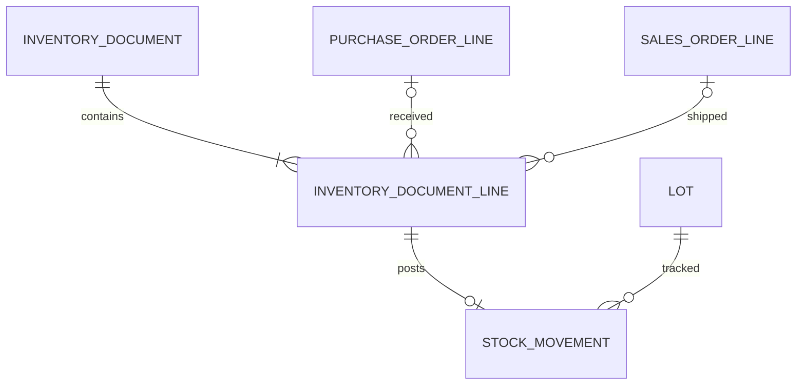

# Thiết kế database và quy tắc giao dịch — Warehouse Atlas

**Baseline v1.0, PostgreSQL 16+; 27 bảng lõi + 10 bảng mở rộng.** SQL và DBML được sinh từ cùng một bộ metadata để giảm sai khác giữa tài liệu và sơ đồ. Đây là thiết kế riêng cho đồ án, không phải bản sao schema của một ERP.

## 1. Độ hạt dữ liệu và nguồn sự thật

Một bucket tồn được xác định bởi **(product_id, location_id, lot_id, condition)**. Warehouse suy ra từ location, không lặp lại ở balance. Mọi hàng đều có lot nội bộ: SKU không cần hạn vẫn có một lot theo lần nhập để lưu nguồn và giá. Không dùng `NULL lot_id` hoặc chung một lô “DEFAULT” cho tất cả lần nhận. Cách này tránh cả trùng bucket do NULL trong unique constraint và mất truy vết giá/lần nhận.

Một lot nội bộ thuộc một SKU và một lần nhận gốc/giá nhập gốc. Hai lần nhận cùng mã lô nhà sản xuất tạo hai lot nội bộ có cùng `manufacturer_lot_code`. Thu hồi phải tìm tất cả các lot con của đúng SKU + mã lô nhà sản xuất. Chuyển/trả lại hàng giữ nguyên lot nội bộ; không tạo mã lô mới chỉ vì đổi vị trí.

- `product`: “Đây là loại hàng gì?”
- `lot`: “Hàng của lần nhận/lô nào, hạn nào, giá nào?”
- `stock_balance`: “Hiện ở ô này có bao nhiêu, đang giữ bao nhiêu?”
- `stock_movement`: “Sự kiện nào khiến số lượng đó thay đổi?”
- `stock_reservation`: “Phần hàng này đang giữ cho dòng đơn nào?”
- `inventory_document`: “Người vận hành xác nhận giao dịch nào?”

**Sổ movement là nguồn gốc lượng tồn. Balance là projection giao dịch để đọc và khóa nhanh.** Cả hai được ghi trong cùng transaction. Tương tự, reservation_event là nhật ký thay đổi; stock_reservation và reserved của balance là trạng thái hiện tại cần đối soát. Không cho màn UI, import hoặc AI cập nhật balance bằng lối riêng.

## 2. Bản đồ các module

| Nhóm | Bảng lõi | Vai trò |
|---|---|---|
| Người dùng | app_role, app_user, user_role | Identity và RBAC |
| Danh mục | category, uom, product, product_uom, product_barcode, partner, supplier_product | SKU, quy đổi và đối tác |
| Không gian | warehouse, location | Kho và cây ô/kệ |
| Lô | lot | Lần nhận, hạn, giá và block |
| Đơn | purchase_order, purchase_order_line, sales_order, sales_order_line | Cam kết và nhu cầu |
| Sổ kho | inventory_document, inventory_document_line, stock_movement, stock_balance | Thực nhập/thực xuất và số dư |
| Giữ hàng | stock_reservation, reservation_event | Ngăn cấp phát trùng |
| Kiểm soát | stocktake, stocktake_line, audit_event | Kiểm kê, thay đổi và dấu vết |
| Bổ sung hàng | reorder_policy | Baseline min/max |

| Nhóm mở rộng | Bảng | Khi thêm |
|---|---|---|
| Map/picking | map_node, map_edge, pick_run, pick_stop | Tuần 5 |
| Phân tích | analysis_run, inventory_alert, replenishment_suggestion | Tuần 5–6 |
| AI | ai_run, ai_tool_call, ai_proposal | Tuần 6 |

Các quan hệ trọng tâm:





Sơ đồ diễn tả quan hệ nghiệp vụ; “chứng từ có ít nhất một dòng” và “chỉ dòng đã POSTED mới có movement” phải do posting service kiểm tra. Toàn bộ cột/FK nằm trong file DBML. Không cần nhồi cả 37 bảng vào một hình trên slide bảo vệ; chia theo hai câu chuyện trên.

## 3. Lượng và đơn vị: công thức phải thống nhất

`qty_base = entered_qty × factor_to_base_snapshot`.

Ví dụ SKU SỮA-180 có base UOM là hộp, quy đổi thùng=48. Nhận 2 thùng → 96 hộp. Sau này đổi quy cách mua sang thùng=24 không được làm phiếu cũ thành 48 hộp. Giá `unit_price` của dòng đơn tính theo UOM người nhập; `lot.unit_cost` tính theo một base UOM. Phiếu 2 thùng, mỗi thùng 240.000đ, hệ số 48 → tổng 480.000đ, giá vốn 5.000đ/hộp. V1 bỏ thuế, chiết khấu phân bổ và landed cost; không âm thầm gọi số này là giá kế toán đầy đủ.

`on_hand`: tồn vật lý của bucket, kể cả hàng đang giữ hoặc hàng bị block.

`active_reserved = allocated_qty − consumed_qty − released_qty`.

`available_now`: nếu bucket đủ điều kiện cấp phát thì `on_hand − reserved`, nếu không đủ điều kiện thì 0. Không lấy toàn bộ on_hand của mọi trạng thái rồi trừ reserved và tiếp tục trừ hàng quarantine lần nữa.

Điều kiện cấp phát v1: product/warehouse/location đang active, location usage=STORAGE, condition=GOOD, lot ACTIVE; nếu track_expiry thì `expires_on > business_date + min_shelf_life_days`. Ngày hết hạn được coi là không còn được xuất; quy ước này phải hiện trong yêu cầu nghiệp vụ. Các ngày dựa trên timezone của warehouse, không dựa tùy ý vào UTC date hoặc đồng hồ người dùng.

Khi xuất theo đơn có ngày giao tương lai, kiểm đủ hạn tại ngày giao kỳ vọng; khi thực ghi shipment kiểm lại ngày giao/ngày thực tế tương ứng. View `v_stock_availability` chỉ trả trạng thái hiện tại; nó không thay thế truy vấn allocation theo ngày giao.

Ví dụ: ô A01/lô L1/GOOD có 100, giữ 30 → available 70. Một bucket QUARANTINE có 20 → available 0. Tổng vật lý 120; lượng cấp phát được 70. Nếu block L1: vật lý vẫn 120, available=0, 30 đang giữ trở thành công việc cần xử lý; không âm thầm xóa reservation.

Không lưu `available`, `order_total`, `received_qty`, `fulfilled_qty` ở nhiều nơi trong bản đầu. Tính bằng query/view; khi cần cache thêm phải định nghĩa cơ chế rebuild và đối soát. Balance/reservation là ngoại lệ denormalization có chủ đích để khóa và đọc nhanh.

## 4. Quy tắc dữ liệu chủ

1. SKU, username được service trim/chuẩn hóa trước ghi; các field unique trong DDL không tự tạo chuẩn hóa hoa/thường. Username lowercase; SKU uppercase theo quy tắc nhóm chốt.
2. Mọi product phải có dòng product_uom cho base_uom với factor=1. FK ghép ngăn lấy quy đổi của SKU khác. UOM không được dùng độ chia nhỏ hơn quy định decimal_places.
3. Không đổi base_uom của product sau khi có giao dịch; không đổi product, unit_cost, received_at, supplier hoặc mã lô quan trọng của lot sau lần nhập đầu. Sửa dữ liệu sai đi qua use case có audit, đánh giá tác động, hoặc tạo bản thay thế.
4. Nếu track_expiry thì bắt buộc expires_on khi nhận hàng. Không bỏ cờ track_expiry để lách chặn xuất; thay đổi cấu hình phải có policy và audit.
5. Parent location phải cùng warehouse (FK ghép), cây không được có chu trình (service duyệt tổ tiên); usage STRUCTURAL không chứa tồn. Không chuyển warehouse/đổi usage của location đã có giao dịch; khóa mềm hoặc tạo location mới.
6. Không sửa parent trong khi đang dùng map/picking nếu việc đổi vị trí làm sai ý nghĩa physical location. Nếu chỉ đổi nhãn phải có audit; replay lượng lịch sử không hứa tái dựng nhãn cũ.
7. Mỗi partner ở PO/supplier_product/lot phải có is_supplier=true; ở SO phải có is_customer=true. FK chỉ kiểm tồn tại, service kiểm vai trò.
8. Dữ liệu master đã có giao dịch chỉ deactivate, không xóa. V1 không dùng soft-delete tổng quát hoặc recycle SKU để tránh quan hệ lịch sử khó hiểu.
9. UOM/lot/supplier không được dùng JSON thay FK. JSON chỉ cho evidence, snapshot thuật toán và audit có schema version ở payload khi cần.

## 5. Chứng từ và state machine

Đơn mua/bán: `DRAFT → CONFIRMED → CLOSED`; nháp/đơn đã xác nhận có thể CANCELLED theo điều kiện. Các nhãn “nhận một phần/giao một phần/đã đủ” được tính từ lượng thực hiện, không nhồi tất cả vào một status cột. Không hủy phần đã xuất/đã nhận bằng cách sửa status đơn; đóng phần chưa thực hiện có `closed_qty_base` và lý do.

Phiếu kho: `DRAFT → APPROVED → POSTED`; DRAFT/APPROVED có thể CANCELLED nếu chưa ghi sổ. Trả APPROVED về DRAFT cần bỏ phê duyệt và tăng version trước khi sửa dòng. POSTED là trạng thái cuối; muốn sửa tác động thì tạo REVERSAL, không đổi phiếu gốc thành chưa tồn tại. UI có thể suy ra nhãn “đã đảo” khi tồn tại phiếu REVERSAL đã POSTED tham chiếu gốc.

P0 có thể cho operator gửi phiếu và manager duyệt/ghi; admin không được vượt invariant kho. Không tự gán ý nghĩa bảo mật cho việc ẩn nút trong UI: service phải kiểm quyền lại.

### Tác động theo loại phiếu

| Kind | Nguồn → đích | Quy tắc đặc biệt |
|---|---|---|
| OPENING | NULL → location | Nhập tồn đầu qua sổ, không seed balance trực tiếp |
| RECEIPT | NULL → location | Tham chiếu PO line khi nhận theo đơn; có thể tới RECEIVING hoặc STORAGE |
| SHIPMENT | location → NULL | SO line + reservation cùng SKU/lô/vị trí; kiểm hạn/block |
| TRANSFER | location A → B | Cùng lot và condition; P0 chỉ chuyển lượng chưa giữ |
| RECLASSIFY | location/condition A → location/condition B | Cùng SKU/lô; đổi chất lượng, có lý do và quyền |
| ADJUSTMENT | NULL → location hoặc location → NULL | Chênh lệch kiểm kê hoặc sửa tồn được duyệt |
| CUSTOMER_RETURN | NULL → location | Dòng xuất gốc; lot gốc; mặc định QUARANTINE |
| SUPPLIER_RETURN | location → NULL | Dòng nhận gốc; không vượt lượng có thể trả và lượng đang có |
| REVERSAL | Đảo nguồn/đích của từng movement gốc | Đảo toàn phiếu, mỗi phiếu tối đa một lần; phải khả thi hiện tại |

Nguồn/đích NULL chỉ biểu diễn đi từ/ra bên ngoài phạm vi kho doanh nghiệp, không phải một location chứa tồn. Điều kiện CHECK trong SQL ngăn dòng không có cả nguồn lẫn đích và chuyển cùng một bucket; service kiểm thêm đúng hướng theo kind.

Nhận vào RECEIVING chưa làm hàng cấp phát được. Putaway là TRANSFER sang STORAGE. Chuyển giữa hai kho vật lý mất thời gian có thể biểu diễn hai phiếu: kho A→vị trí TRANSIT, rồi TRANSIT→kho B. V1 chưa có aggregate vận tải, SLA và nhận thiếu của chuyến; không coi demo chuyển tức thời là đã giải quyết đầy đủ hàng đang vận chuyển.

### Nhận/giao/trả một phần

Một PO line đặt 100 có thể nhận 60 + 40 qua hai phiếu, hai lot nội bộ. Một SO line cần 50 có thể cấp từ L1=30 và L2=20; có hai dòng phiếu và hai reservation. Tổng thực hiện không được vượt ordered_qty×factor trừ khi nghiệp vụ overdelivery được thiết kế riêng (v1 cấm).

`remaining_to_fulfill = ordered_base − effective_fulfilled_base − closed_qty_base`.

`effective_fulfilled_base` cộng nhận/xuất đã POSTED, trừ đúng các REVERSAL của chúng. CUSTOMER_RETURN không tự mở lại SO và SUPPLIER_RETURN không tự mở lại PO. Trả thương mại có thống kê riêng; muốn đặt lại/tái giao phải tạo đơn/dòng thay thế rõ ràng. `original_line_id` cho phép kiểm tổng trả theo dòng nguồn; REVERSAL của phiếu trả phải giảm tổng đã trả tương ứng. Không dùng ABS mọi movement để tính doanh số/nhu cầu.

Mỗi dòng shipment phải liên kết phần reservation được tiêu thụ qua reservation_event CONSUME. Tổng event CONSUME cho dòng phải bằng qty_base của dòng. Một lần quét nhãn chỉ cập nhật checklist pick_stop; chưa trừ tồn cho tới khi shipment POSTED. V1 không ghi nhận riêng lượng đã dịch chuyển vật lý tới bàn đóng gói giữa lúc pick và ship; cần nêu giới hạn này nếu mở rộng DISPATCH staging về sau.

## 6. Transaction chuẩn để ghi sổ

Đề xuất v1 ưu tiên tính dễ kiểm chứng: **serialize các nghiệp vụ ghi trong cùng kho bằng khóa hàng warehouse**. Mức song song thấp hơn khóa tinh tới từng bucket, nhưng phù hợp quy mô lớp học và tránh đọc thiếu bucket mới/phức tạp cấp phát. Vẫn khóa rõ các bản ghi cần thay đổi; khi có số đo mới cân nhắc giảm độ thô của khóa.

Thứ tự khóa chung: warehouse theo UUID tăng dần → document và order headers theo loại cố định rồi UUID → location theo UUID → lot theo UUID → balance theo UUID → reservation theo UUID. Khóa nhiều kho khi chuyển liên kho. Mọi use case liên quan tuân cùng thứ tự; không có luồng lấy balance trước rồi quay lại warehouse. `BlockLot` có thể chỉ khóa lot, đổi flag/audit rồi commit; không đi tiếp ngược lên warehouse trong transaction đó. Nhả/chuyển reservation bị ảnh hưởng thực hiện trong use case riêng sau đó.

PostDocument nhận `document_id, expected_version, idempotency_key, actor`. Trong **một transaction**:

1. Đọc các khóa mục tiêu từ draft; khóa warehouse liên quan theo thứ tự. Khóa lại phiếu và xác nhận version/nội dung không thay đổi; nếu nguồn/đích đã đổi trong lúc chờ thì abort và bắt đầu lại với đúng khóa. DB/service không cho thay warehouse của location đã được dùng.
2. Kiểm role, status, phê duyệt, có ít nhất một dòng, cùng kind và hướng hợp lệ. Nếu phiếu đã POSTED với cùng key/hash thì trả kết quả cũ; cùng key với payload khác thì báo conflict. Key duy nhất cũng chặn dùng lại ở phiếu khác.
3. Khóa order headers/lines liên quan và tính lượng thực hiện hiện tại; kiểm nhận/xuất/trả còn hợp lệ. Khóa location, kiểm không trong phiên COUNTING/REVIEW. Không nhận thêm vào một ô đang được đếm.
4. Khóa lot, kiểm product/lot/quy đổi, hạn và recall_status khi xuất/cấp phát. Tạo zero balance còn thiếu bằng INSERT ON CONFLICT DO NOTHING rồi khóa nó. Không có tình huống “khóa hàng chưa tồn tại” mà bỏ qua.
5. Gộp delta theo bucket, không kiểm từng dòng độc lập trên cùng số dư cũ. Ví dụ hai dòng cùng lấy 7 và 6 từ bucket 10 phải bị từ chối vì tổng lấy 13.
6. Kiểm on_hand cuối >=0, reserved cuối >=0 và reserved cuối<=on_hand. Xuất theo reservation giảm đồng thời on_hand/reserved và tăng consumed; transfer không được lấy phần giữ cho đơn khác. Có thể ship một phần reservation và giữ phần còn lại.
7. Sinh movement một lần cho mỗi dòng, với trường dữ liệu khớp tuyệt đối dòng phiếu. Một timestamp ghi sổ được lấy từ DB và dùng chung cho phiếu/movement của lần posting. Ghi balance, reservation_event, trạng thái reservation và audit trong cùng transaction.
8. Cập nhật phiếu POSTED, actor, timestamp, idempotency key/hash; commit. Nếu bất kỳ kiểm tra/ghi nào lỗi thì rollback toàn bộ. Sau commit mới refresh UI hoặc gửi dữ liệu cho phân tích.

`UNIQUE(document_line_id)` ngăn một dòng có hai movement; nó không tự thực hiện idempotency toàn use case. SQLAlchemy UnitOfWork bao transaction; không đặt transaction kéo dài bao quanh hộp thoại xác nhận hoặc LLM. PostgreSQL có cơ chế row lock và quy tắc deadlock cần tuân thủ. [Tài liệu PostgreSQL](https://www.postgresql.org/docs/current/explicit-locking.html).

Nếu mất kết nối sau commit nhưng trước khi UI nhận thành công: retry cùng key sẽ đọc kết quả cũ. Dùng retry giới hạn cho lỗi serialization/deadlock có thể thử lại; không retry vô hạn lỗi validation. Mỗi thread/process có session riêng.

## 7. Các tình huống khó phải định nghĩa trước

### Cạnh tranh cấp phát

Kho có 10, hai đơn mỗi đơn cần 7. Chính sách v1 **all-or-nothing cho một lần reserve**: transaction A giữ 7; B thấy chỉ còn 3 sau khi chờ khóa và nhận thông báo thiếu 4, không tạo reservation một phần. Nếu cho phép giao thiếu, người dùng chọn rõ “giữ một phần”; đây là cờ use case, không hành vi ngầm. Ca demo mặc định all-or-nothing.

### Reservation hết hạn

Tồn reserved không tự giảm khi clock vượt expires_at. Worker expiry hoặc thao tác reserve mới phát hiện các hold đến hạn, khóa và tăng released_qty, thêm event EXPIRE, giảm balance.reserved trong một transaction. Trong lúc worker chưa chạy, expired reservation vẫn chiếm lượng; an toàn hơn việc view loại nó nhưng balance vẫn còn. Trước khi ship, hết hạn phải được xử lý; không tiêu thụ reservation đã EXPIRE.

### Lô bị block khi đã giữ

Allocation/Shipment khóa và kiểm lot, do đó block có thứ tự rõ với posting. Nếu shipment đã commit trước block thì nó nằm trong danh sách hàng đã xuất cần thu hồi. Nếu block trước thì shipment bị chặn. Reservation cũ còn hiện để quản lý quyết định nhả rồi cấp lại; không cho xuất chỉ vì đã có reservation.

### Kiểm kê trong lúc có giao dịch

Bắt đầu count: khóa warehouse/location, kiểm chưa có phiên active, chụp expected từng bucket rồi chuyển COUNTING và commit. Mọi nghiệp vụ làm thay đổi lượng/giữ trong location phải từ chối khi COUNTING/REVIEW. Không giữ một transaction DB mở trong suốt 20 phút con người đếm.

Người đếm không thấy expected_qty. Hàng tìm thấy chưa có bucket: tạo stocktake_line với expected=0, lot phải được xác minh trước. Hàng đang có nhưng đếm không thấy phải nhập counted=0, không bỏ hàng đó khỏi phiên. Đếm lại lưu recount; số cuối = COALESCE(recounted,counted).

Finalize: khóa theo chuẩn, kiểm snapshot không bị thay đổi, có lý do chênh lệch, tất cả dòng đã đếm; tạo ADJUSTMENT cho delta. Nếu actual<reserved thì không thể post ngay: giữ phiên REVIEW, manager chọn release/reallocate phần reservation thiếu trong một use case dành riêng cho phiên này, có audit. Use case đó được phép xử lý reservation của ô bị freeze nhưng không được tự thay on_hand. Sau đó finalize lại mới hợp lệ. Phiên POSTED/CANCELLED nhả freeze.

### Đảo không phải nút quay ngược thời gian

Đảo phiếu bằng movement đối ứng ở thời điểm hiện tại. Muốn đảo nhận 100 mà đã xuất 70 thì không thể xóa nhận 100: hiện không đủ hàng để trừ 100. Hệ thống báo phụ thuộc, yêu cầu xử lý nghiệp vụ tiếp theo phù hợp. Muốn trả nhà cung cấp 30 còn lại thì dùng SUPPLIER_RETURN cho 30, không gọi đó là đảo toàn bộ phiếu nhập.

Đảo shipment khi hàng thực tế chưa quay về là một nghiệp vụ điều chỉnh hồ sơ, phải có quyền/lý do. V1 chỉ cho đảo khi không có chứng từ phụ thuộc và kiểm được điều kiện hiện tại; trả hàng vật lý dùng CUSTOMER_RETURN về QUARANTINE. Nếu đảo shipment, reservation đã tiêu thụ không tự sống lại; nhu cầu còn lại của SO được tính lại và phải reserve mới. Hàng bị block/hết hạn vẫn không tự trở thành eligible sau đảo.

### Giá vốn và serial

V1 dùng giá cố định của lot nội bộ, số lượng×unit_cost cho báo cáo giá trị vận hành. FEFO lựa chọn hàng vật lý không đồng nghĩa FIFO kế toán. Không triển khai moving average/FIFO valuation layers hoặc đối chiếu sổ cái. Nếu giảng viên yêu cầu accounting, đó là thay đổi phạm vi và cần valuation ledger riêng. Serial-level tracking cũng chưa có; không nhét serial vào một cột text rồi tuyên bố đã quản lý từng thiết bị.

## 8. Ràng buộc: database làm gì, service làm gì?

| Quy tắc | Cơ chế trong SQL baseline | Phần service phải bổ sung |
|---|---|---|
| PK/FK/UNIQUE, đúng product-lot/UOM | Có PK, FK ghép, unique | Chuẩn hóa mã, kiểm active |
| Lượng dương, số dư không âm, giữ<=tồn | Có CHECK | Gộp delta và khóa trước cập nhật |
| Cây vị trí không chu trình | Chặn tự làm cha, FK cùng kho | Duyệt ancestor; cấm đổi warehouse khi đã dùng |
| SKU theo hạn phải có expiry | Chưa có cross-table trigger | Kiểm khi tạo lot/nhận hàng |
| Movement khớp phiếu | FK line/product/lot; unique line | So khớp qty/source/destination/condition, kind và timestamp |
| Không sửa sổ movement/event/audit | Trigger chặn UPDATE/DELETE | Runtime DB role cấm TRUNCATE/DDL; không dùng owner/superuser |
| Phiếu POSTED bất biến | Trigger guard trong baseline | State machine đầy đủ, duyệt và version |
| Balance khớp ledger | View đối soát | Cập nhật cùng transaction, recovery/rebuild được kiểm thử |
| Tổng reservation khớp balance | View đối soát snapshot | Event invariants và stock_reservation phải đồng bộ |
| Không nhận/xuất vượt đơn; trả không vượt gốc | FK dòng nguồn | Khóa và SUM các phiếu đã post/đảo |
| One active count/location | Partial unique index | Freeze workflows và review chênh lệch |
| Idempotency | Unique key và unique movement/line | Payload hash, trả kết quả đã commit |
| AI proposal không áp dụng dữ liệu cũ | Lưu input_hash/status/result | Revalidate dữ liệu hiện tại + quyền trong transaction |

SQL schema chạy được chưa có nghĩa các hàng trên đều đã được thực thi. Đây là ranh giới bàn giao bắt buộc cho đội agent. Bộ test phải có thao tác qua service và kiểm từ DB, không chỉ test widget.

## 9. Truy vấn chủ chốt

### 9.1 Xem tồn hiện tại và lượng cấp phát được

```sql
SELECT p.sku, l.code AS location, lot.code AS lot,
       a.condition, a.on_hand, a.reserved, a.available_now
FROM v_stock_availability a
JOIN product p ON p.id=a.product_id
JOIN location l ON l.id=a.location_id
JOIN lot ON lot.id=a.lot_id
WHERE p.sku = :sku
ORDER BY l.code, lot.expires_on NULLS LAST, lot.received_at;
```

Đây là query đọc. Candidate allocation còn phải khóa theo quy trình ở trên và kiểm hạn theo ngày giao; không chỉ lấy kết quả view cũ rồi ghi.

### 9.2 Đối soát số dư

```sql
SELECT * FROM v_inventory_reconciliation
WHERE qty_difference <> 0 OR reserved_difference <> 0;
```

Kết quả bình thường là không có hàng. Ngoài view này còn cần kiểm: SUM ALLOCATE events = allocated_qty; SUM CONSUME = consumed_qty; SUM RELEASE+EXPIRE = released_qty; mỗi dòng shipment có consumption đủ; mỗi dòng phiếu POSTED có movement khớp. Balance tốt chưa chứng minh mọi quan hệ đã tốt.

### 9.3 Tồn đã được hệ thống ghi nhận tại thời điểm T

```sql
SELECT product_id, location_id, lot_id, condition, SUM(delta_qty) AS qty_at_t
FROM v_stock_ledger_leg
WHERE recorded_at <= :as_of
GROUP BY product_id, location_id, lot_id, condition
HAVING SUM(delta_qty) <> 0;
```

Không bỏ movement gốc khi có reversal: reversal là chân ngược tại thời điểm mới. `recorded_at` là mốc ghi sổ nghiệp vụ được đặt trong transaction, không phải một cơ chế lưu timestamp commit vật lý của PostgreSQL. Tái dựng theo mốc ghi sổ đó; nếu cần “chính xác dữ liệu đã nhìn thấy ở thời điểm commit T” thì phải bổ sung cơ chế lịch sử khác.

### 9.4 Truy vết lô nhà sản xuất

```sql
SELECT d.code AS document_code, d.kind, d.posted_at,
       p.sku, lot.code AS internal_lot, lot.manufacturer_lot_code,
       dl.qty_base, partner.name AS counterparty
FROM lot
JOIN product p ON p.id=lot.product_id
JOIN inventory_document_line dl ON dl.lot_id=lot.id
JOIN inventory_document d ON d.id=dl.document_id
LEFT JOIN partner ON partner.id=d.partner_id
WHERE p.sku=:sku AND lot.manufacturer_lot_code=:manufacturer_lot
  AND d.status='POSTED'
ORDER BY d.posted_at, d.id, dl.line_no;
```

Để tính khách thực còn giữ hàng, thêm customer returns và reversal theo original_line_id, không chỉ đếm SHIPMENT. Báo cáo impact phải phân biệt “từng nhận” với “lượng chưa trả”.

### 9.5 Giá trị vận hành theo kho

```sql
SELECT w.code, SUM(b.on_hand * lot.unit_cost) AS value_vnd
FROM stock_balance b
JOIN lot ON lot.id=b.lot_id
JOIN location l ON l.id=b.location_id
JOIN warehouse w ON w.id=l.warehouse_id
GROUP BY w.code;
```

Báo cáo này gồm cả hàng QUARANTINE/DAMAGED theo giá nhập; thêm cột tách trạng thái để quản lý thấy phần đang bị chặn. Không tự coi damaged có giá trị thu hồi bằng 0 nếu chưa có chính sách write-down.

### 9.6 Số liệu phục vụ đề xuất phải cùng snapshot

Một lần compute_replenishment đọc số dư đủ điều kiện, nhu cầu đơn còn mở và PO chưa nhận trong một read-only snapshot nhất quán (ví dụ transaction REPEATABLE READ ngắn). Inbound = tổng còn nhận của PO CONFIRMED, trừ các lượng đã nhận hiệu lực và lượng đã đóng thiếu; phải tách phần quá ngày dự kiến. Eligible_on_hand chưa trừ reservation; open_order_demand đã gồm phần đang giữ, nên không trừ reservation lần hai. Lưu cutoff/snapshot vào analysis_run. Các tool được gọi ở thời điểm khác nhau có thể trả as_of khác nhau; AI không được gộp số liệu như thể cùng một snapshot nếu cần tính toán chính xác. Không giữ transaction đó trong khi chờ model trả lời.

Với bảng mở rộng, service còn kiểm map_node.location_id cùng warehouse, các pick_stop thuộc đúng đơn/kho/reservation, lot của alert đúng product, và supplier của suggestion thật sự cung ứng SKU. File SQL mới bảo vệ một phần qua FK; chưa chứa toàn bộ kiểm tra chéo nghiệp vụ này.

## 10. Index, hiệu năng và vận hành

Baseline đặt index cho các FK, unique bucket, product+expiry, product+recorded_at, mã lô nhà sản xuất, trạng thái/ngày ghi phiếu và reservation còn hoạt động. Một số index FK có thể trùng prefix của unique index; sau khi có query plan mới loại bớt. Không tuyên bố mọi query nhanh chỉ vì đã tạo index.

Các bảng GUI luôn filter/paginate ở DB; không tải 100.000 movement vào Treeview rồi mới lọc. Mục tiêu ban đầu: 2.000 SKU, 100.000 movement, bảng 100 hàng/trang; tìm theo SKU hoặc phân trang p95<500ms trên máy demo sau warm-up; mở detail p95<1s. Đây là mục tiêu phải đo, không phải kết quả đã có. Ghi CPU/RAM, phiên bản PG, dataset, số lượt và query plan trong báo cáo.

Backup bằng công cụ PostgreSQL, restore vào database demo mới và chạy đối soát. Script seed/reset chỉ nhắm database demo được cấu hình rõ. Không dùng credentials DB owner trong GUI, không lưu mật khẩu AI/DB vào audit/evidence, không commit file môi trường chứa bí mật. Quyền ứng dụng vẫn phải được kiểm tại service; đây là đồ án desktop trong môi trường tin cậy, chưa là mô hình server authorization cho mạng công cộng.

## 11. Cách dùng các file schema

1. Dùng database riêng, chạy `03_schema_core.sql` trước.
2. Chạy `04_schema_extensions.sql` khi bắt đầu P1; tên bảng không có prefix khác.
3. `05_erd.dbml` chứa cả core và extension, chia TableGroup để import vào công cụ đọc DBML hoặc dùng làm nguồn dựng ERD.
4. Thêm Alembic migration tương ứng vào repo triển khai, pin phiên bản; không chạy lại baseline CREATE TABLE trên database đã có dữ liệu.
5. Implement service invariants và tests theo mục 8 trước khi cho UI ghi dữ liệu thật.

Phần tiếp theo là từ điển đầy đủ 37 bảng, được sinh trực tiếp từ schema metadata.

---

# Từ điển dữ liệu

PK = khóa chính; FK = khóa ngoại; NN = bắt buộc. UUID dùng định danh nội bộ; mã code/sku phục vụ hiển thị và tìm kiếm. Giá và lượng đều dùng NUMERIC, Python dùng Decimal.

## app_role — core

Ba vai trò cố định: ADMIN, MANAGER, OPERATOR; quyền ánh xạ trong policy của ứng dụng.

| Cột | Kiểu | Ràng buộc / mặc định | Ý nghĩa |
|---|---|---|---|
| `id` | `uuid` | PK, NN, DEFAULT gen_random_uuid() | Khóa nội bộ; không dùng mã hiển thị làm khóa ngoại. |
| `code` | `text` | NN, UNIQUE |  |
| `name` | `text` | NN |  |

## app_user — core

Tài khoản của người vận hành; vô hiệu hóa thay vì xóa.

| Cột | Kiểu | Ràng buộc / mặc định | Ý nghĩa |
|---|---|---|---|
| `id` | `uuid` | PK, NN, DEFAULT gen_random_uuid() | Khóa nội bộ; không dùng mã hiển thị làm khóa ngoại. |
| `username` | `text` | NN, UNIQUE | Service chuẩn hóa lowercase trước khi ghi. |
| `password_hash` | `text` | NN | Hash mật khẩu, không lưu mật khẩu thô. |
| `display_name` | `text` | NN |  |
| `is_active` | `boolean` | NN, DEFAULT true |  |
| `created_at` | `timestamptz` | NN, DEFAULT now() | Thời điểm hệ thống ghi nhận, lưu UTC. |

## user_role — core

Quan hệ nhiều-nhiều giữa tài khoản và vai trò.

| Cột | Kiểu | Ràng buộc / mặc định | Ý nghĩa |
|---|---|---|---|
| `user_id` | `uuid` | NN, FK → app_user.id |  |
| `role_id` | `uuid` | NN, FK → app_role.id |  |

Khóa duy nhất: `(user_id, role_id)`.

## category — core

Nhóm hàng; phiên bản đầu dùng một cấp để giảm độ phức tạp.

| Cột | Kiểu | Ràng buộc / mặc định | Ý nghĩa |
|---|---|---|---|
| `id` | `uuid` | PK, NN, DEFAULT gen_random_uuid() | Khóa nội bộ; không dùng mã hiển thị làm khóa ngoại. |
| `code` | `text` | NN, UNIQUE |  |
| `name` | `text` | NN |  |
| `is_active` | `boolean` | NN, DEFAULT true |  |

## uom — core

Đơn vị đo: chai, gói, thùng, kg; mỗi SKU có một đơn vị tồn chuẩn.

| Cột | Kiểu | Ràng buộc / mặc định | Ý nghĩa |
|---|---|---|---|
| `id` | `uuid` | PK, NN, DEFAULT gen_random_uuid() | Khóa nội bộ; không dùng mã hiển thị làm khóa ngoại. |
| `code` | `text` | NN, UNIQUE |  |
| `name` | `text` | NN |  |
| `decimal_places` | `integer` | NN, DEFAULT 0 | 0 cho hàng đếm chiếc, tối đa 4 chữ số lẻ. |

CHECK tại database:
- `decimal_places BETWEEN 0 AND 4`

## product — core

Một hàng tương ứng một SKU bán được; không chứa cột số lượng tồn.

| Cột | Kiểu | Ràng buộc / mặc định | Ý nghĩa |
|---|---|---|---|
| `id` | `uuid` | PK, NN, DEFAULT gen_random_uuid() | Khóa nội bộ; không dùng mã hiển thị làm khóa ngoại. |
| `sku` | `text` | NN, UNIQUE |  |
| `name` | `text` | NN |  |
| `category_id` | `uuid` | NN, FK → category.id |  |
| `base_uom_id` | `uuid` | NN, FK → uom.id |  |
| `track_expiry` | `boolean` | NN, DEFAULT false |  |
| `min_shelf_life_days` | `integer` | NN, DEFAULT 0 | Hạn còn tối thiểu khi xuất; 0 vẫn phải chưa hết hạn. |
| `is_active` | `boolean` | NN, DEFAULT true |  |
| `created_at` | `timestamptz` | NN, DEFAULT now() | Thời điểm hệ thống ghi nhận, lưu UTC. |
| `version` | `integer` | NN, DEFAULT 1 | Tăng mỗi lần sửa; dùng kiểm tra xung đột bản nháp. |

CHECK tại database:
- `min_shelf_life_days >= 0`

## product_uom — core

Quy đổi theo SKU; thùng của SKU A không nhất thiết bằng thùng của SKU B.

| Cột | Kiểu | Ràng buộc / mặc định | Ý nghĩa |
|---|---|---|---|
| `id` | `uuid` | PK, NN, DEFAULT gen_random_uuid() | Khóa nội bộ; không dùng mã hiển thị làm khóa ngoại. |
| `product_id` | `uuid` | NN, FK → product.id |  |
| `uom_id` | `uuid` | NN, FK → uom.id |  |
| `factor_to_base` | `numeric(18,4)` | NN | 1 thùng = 24 chai thì factor=24. |

Khóa duy nhất: `(product_id, uom_id)`; `(id, product_id)`.

CHECK tại database:
- `factor_to_base > 0`

## product_barcode — core

Barcode nhận diện SKU và quy cách đóng gói; QR lô dùng mã lot riêng.

| Cột | Kiểu | Ràng buộc / mặc định | Ý nghĩa |
|---|---|---|---|
| `id` | `uuid` | PK, NN, DEFAULT gen_random_uuid() | Khóa nội bộ; không dùng mã hiển thị làm khóa ngoại. |
| `code` | `text` | NN, UNIQUE |  |
| `product_uom_id` | `uuid` | NN, FK → product_uom.id |  |
| `is_active` | `boolean` | NN, DEFAULT true |  |

## partner — core

Một đối tác có thể đồng thời là nhà cung cấp và khách hàng.

| Cột | Kiểu | Ràng buộc / mặc định | Ý nghĩa |
|---|---|---|---|
| `id` | `uuid` | PK, NN, DEFAULT gen_random_uuid() | Khóa nội bộ; không dùng mã hiển thị làm khóa ngoại. |
| `code` | `text` | NN, UNIQUE |  |
| `name` | `text` | NN |  |
| `is_supplier` | `boolean` | NN, DEFAULT false |  |
| `is_customer` | `boolean` | NN, DEFAULT false |  |
| `phone` | `text` |  |  |
| `email` | `text` |  |  |
| `address` | `text` |  |  |
| `is_active` | `boolean` | NN, DEFAULT true |  |

CHECK tại database:
- `is_supplier OR is_customer`

## supplier_product — core

Danh mục cung ứng để gợi ý mua; giá ở đây chỉ là báo giá tham khảo hiện tại.

| Cột | Kiểu | Ràng buộc / mặc định | Ý nghĩa |
|---|---|---|---|
| `id` | `uuid` | PK, NN, DEFAULT gen_random_uuid() | Khóa nội bộ; không dùng mã hiển thị làm khóa ngoại. |
| `supplier_id` | `uuid` | NN, FK → partner.id |  |
| `product_id` | `uuid` | NN, FK → product.id |  |
| `supplier_sku` | `text` |  |  |
| `lead_time_days` | `integer` | NN |  |
| `moq_base` | `numeric(18,4)` | NN, DEFAULT 0 | Số lượng đặt tối thiểu theo đơn vị chuẩn. |
| `order_multiple_base` | `numeric(18,4)` | NN, DEFAULT 1 | Bội số đặt hàng theo đơn vị chuẩn. |
| `quoted_unit_cost` | `numeric(18,4)` |  | VND trên một đơn vị chuẩn. |
| `is_preferred` | `boolean` | NN, DEFAULT false |  |

Khóa duy nhất: `(supplier_id, product_id)`.

CHECK tại database:
- `lead_time_days >= 0`
- `moq_base >= 0`
- `order_multiple_base > 0`
- `quoted_unit_cost IS NULL OR quoted_unit_cost >= 0`

## warehouse — core

Đơn vị kho; seed 1 kho chính và 1 kho phụ để kiểm chứng chuyển kho.

| Cột | Kiểu | Ràng buộc / mặc định | Ý nghĩa |
|---|---|---|---|
| `id` | `uuid` | PK, NN, DEFAULT gen_random_uuid() | Khóa nội bộ; không dùng mã hiển thị làm khóa ngoại. |
| `code` | `text` | NN, UNIQUE |  |
| `name` | `text` | NN |  |
| `timezone` | `text` | NN, DEFAULT 'Asia/Ho_Chi_Minh' |  |
| `is_active` | `boolean` | NN, DEFAULT true |  |

## location — core

Cây vị trí trong cùng warehouse; node cấu trúc không được chứa tồn.

| Cột | Kiểu | Ràng buộc / mặc định | Ý nghĩa |
|---|---|---|---|
| `id` | `uuid` | PK, NN, DEFAULT gen_random_uuid() | Khóa nội bộ; không dùng mã hiển thị làm khóa ngoại. |
| `warehouse_id` | `uuid` | NN, FK → warehouse.id |  |
| `parent_id` | `uuid` |  | FK ghép bảo đảm cha cùng kho. |
| `code` | `text` | NN |  |
| `name` | `text` | NN |  |
| `usage` | `text` | NN | STRUCTURAL, STORAGE, RECEIVING, DISPATCH hoặc TRANSIT. |
| `is_active` | `boolean` | NN, DEFAULT true |  |

Khóa duy nhất: `(warehouse_id, code)`; `(id, warehouse_id)`.

Khóa ngoại ghép: `(parent_id, warehouse_id) → location(id, warehouse_id)`.

CHECK tại database:
- `usage IN ('STRUCTURAL','STORAGE','RECEIVING','DISPATCH','TRANSIT')`
- `parent_id IS NULL OR parent_id <> id`

## lot — core

Lô nội bộ gắn SKU và một lần nhận hàng/giá nhận. Cùng mã lô nhà sản xuất có thể có nhiều lot nội bộ.

| Cột | Kiểu | Ràng buộc / mặc định | Ý nghĩa |
|---|---|---|---|
| `id` | `uuid` | PK, NN, DEFAULT gen_random_uuid() | Khóa nội bộ; không dùng mã hiển thị làm khóa ngoại. |
| `product_id` | `uuid` | NN, FK → product.id |  |
| `code` | `text` | NN, UNIQUE |  |
| `manufacturer_lot_code` | `text` |  | Mã dùng tìm tất cả lô con khi thu hồi. |
| `supplier_id` | `uuid` | FK → partner.id |  |
| `manufactured_on` | `date` |  |  |
| `expires_on` | `date` |  | NULL nếu hàng không theo dõi hạn. |
| `received_at` | `timestamptz` | NN | Thời điểm lần nhập gốc; không đổi khi chuyển vị trí. |
| `unit_cost` | `numeric(18,4)` | NN | Giá nhập trên một đơn vị chuẩn; cố định sau nhập đầu tiên. |
| `recall_status` | `text` | NN, DEFAULT 'ACTIVE' |  |
| `block_reason` | `text` |  |  |
| `created_at` | `timestamptz` | NN, DEFAULT now() | Thời điểm hệ thống ghi nhận, lưu UTC. |

Khóa duy nhất: `(id, product_id)`.

CHECK tại database:
- `unit_cost >= 0`
- `recall_status IN ('ACTIVE','BLOCKED')`
- `manufactured_on IS NULL OR expires_on IS NULL OR manufactured_on <= expires_on`

## purchase_order — core

Cam kết mua/bán; xác nhận đơn chưa làm thay đổi tồn thực tế.

| Cột | Kiểu | Ràng buộc / mặc định | Ý nghĩa |
|---|---|---|---|
| `id` | `uuid` | PK, NN, DEFAULT gen_random_uuid() | Khóa nội bộ; không dùng mã hiển thị làm khóa ngoại. |
| `code` | `text` | NN, UNIQUE |  |
| `supplier_id` | `uuid` | NN, FK → partner.id |  |
| `warehouse_id` | `uuid` | NN, FK → warehouse.id |  |
| `status` | `text` | NN, DEFAULT 'DRAFT' |  |
| `expected_on` | `date` |  |  |
| `created_by` | `uuid` | NN, FK → app_user.id |  |
| `created_at` | `timestamptz` | NN, DEFAULT now() | Thời điểm hệ thống ghi nhận, lưu UTC. |
| `version` | `integer` | NN, DEFAULT 1 | Tăng mỗi lần sửa; dùng kiểm tra xung đột bản nháp. |

CHECK tại database:
- `status IN ('DRAFT','CONFIRMED','CLOSED','CANCELLED')`

## purchase_order_line — core

Dòng đặt hàng; received/shipped/outstanding được tính từ các chứng từ đã ghi sổ.

| Cột | Kiểu | Ràng buộc / mặc định | Ý nghĩa |
|---|---|---|---|
| `id` | `uuid` | PK, NN, DEFAULT gen_random_uuid() | Khóa nội bộ; không dùng mã hiển thị làm khóa ngoại. |
| `order_id` | `uuid` | NN, FK → purchase_order.id |  |
| `line_no` | `integer` | NN |  |
| `product_id` | `uuid` | NN, FK → product.id |  |
| `product_uom_id` | `uuid` | NN | FK ghép tới product_uom bảo đảm đúng SKU. |
| `ordered_qty` | `numeric(18,4)` | NN | Số lượng theo đơn vị người nhập. |
| `factor_to_base_snapshot` | `numeric(18,4)` | NN | Đóng băng hệ số để lịch sử không đổi khi sửa quy cách. |
| `unit_price` | `numeric(18,4)` | NN | VND theo đơn vị người nhập; không trộn với giá vốn lot. |
| `closed_qty_base` | `numeric(18,4)` | NN, DEFAULT 0 | Phần đơn đóng thiếu có lý do, không được tính như đã giao. |
| `close_reason` | `text` |  |  |

Khóa duy nhất: `(order_id, line_no)`; `(id, product_id)`.

Khóa ngoại ghép: `(product_uom_id, product_id) → product_uom(id, product_id)`.

CHECK tại database:
- `line_no > 0`
- `ordered_qty > 0`
- `factor_to_base_snapshot > 0`
- `unit_price >= 0`
- `closed_qty_base >= 0`
- `closed_qty_base <= ordered_qty * factor_to_base_snapshot`

## sales_order — core

Cam kết mua/bán; xác nhận đơn chưa làm thay đổi tồn thực tế.

| Cột | Kiểu | Ràng buộc / mặc định | Ý nghĩa |
|---|---|---|---|
| `id` | `uuid` | PK, NN, DEFAULT gen_random_uuid() | Khóa nội bộ; không dùng mã hiển thị làm khóa ngoại. |
| `code` | `text` | NN, UNIQUE |  |
| `customer_id` | `uuid` | NN, FK → partner.id |  |
| `warehouse_id` | `uuid` | NN, FK → warehouse.id |  |
| `status` | `text` | NN, DEFAULT 'DRAFT' |  |
| `expected_on` | `date` |  |  |
| `created_by` | `uuid` | NN, FK → app_user.id |  |
| `created_at` | `timestamptz` | NN, DEFAULT now() | Thời điểm hệ thống ghi nhận, lưu UTC. |
| `version` | `integer` | NN, DEFAULT 1 | Tăng mỗi lần sửa; dùng kiểm tra xung đột bản nháp. |

CHECK tại database:
- `status IN ('DRAFT','CONFIRMED','CLOSED','CANCELLED')`

## sales_order_line — core

Dòng đặt hàng; received/shipped/outstanding được tính từ các chứng từ đã ghi sổ.

| Cột | Kiểu | Ràng buộc / mặc định | Ý nghĩa |
|---|---|---|---|
| `id` | `uuid` | PK, NN, DEFAULT gen_random_uuid() | Khóa nội bộ; không dùng mã hiển thị làm khóa ngoại. |
| `order_id` | `uuid` | NN, FK → sales_order.id |  |
| `line_no` | `integer` | NN |  |
| `product_id` | `uuid` | NN, FK → product.id |  |
| `product_uom_id` | `uuid` | NN | FK ghép tới product_uom bảo đảm đúng SKU. |
| `ordered_qty` | `numeric(18,4)` | NN | Số lượng theo đơn vị người nhập. |
| `factor_to_base_snapshot` | `numeric(18,4)` | NN | Đóng băng hệ số để lịch sử không đổi khi sửa quy cách. |
| `unit_price` | `numeric(18,4)` | NN | VND theo đơn vị người nhập; không trộn với giá vốn lot. |
| `closed_qty_base` | `numeric(18,4)` | NN, DEFAULT 0 | Phần đơn đóng thiếu có lý do, không được tính như đã giao. |
| `close_reason` | `text` |  |  |

Khóa duy nhất: `(order_id, line_no)`; `(id, product_id)`.

Khóa ngoại ghép: `(product_uom_id, product_id) → product_uom(id, product_id)`.

CHECK tại database:
- `line_no > 0`
- `ordered_qty > 0`
- `factor_to_base_snapshot > 0`
- `unit_price >= 0`
- `closed_qty_base >= 0`
- `closed_qty_base <= ordered_qty * factor_to_base_snapshot`

## inventory_document — core

Phiếu nhập, xuất, chuyển, đổi trạng thái, kiểm kê, trả hàng hoặc bút toán đảo.

| Cột | Kiểu | Ràng buộc / mặc định | Ý nghĩa |
|---|---|---|---|
| `id` | `uuid` | PK, NN, DEFAULT gen_random_uuid() | Khóa nội bộ; không dùng mã hiển thị làm khóa ngoại. |
| `code` | `text` | NN, UNIQUE |  |
| `kind` | `text` | NN |  |
| `status` | `text` | NN, DEFAULT 'DRAFT' |  |
| `partner_id` | `uuid` | FK → partner.id |  |
| `reversal_of_id` | `uuid` | FK → inventory_document.id |  |
| `idempotency_key` | `uuid` | UNIQUE | Khóa yêu cầu ghi sổ, dùng lại khi retry. |
| `posting_payload_hash` | `text` |  | Hash payload chuẩn hóa, phát hiện reuse key với nội dung khác. |
| `reason` | `text` |  |  |
| `created_by` | `uuid` | NN, FK → app_user.id |  |
| `approved_by` | `uuid` | FK → app_user.id |  |
| `posted_by` | `uuid` | FK → app_user.id |  |
| `posted_at` | `timestamptz` |  |  |
| `created_at` | `timestamptz` | NN, DEFAULT now() | Thời điểm hệ thống ghi nhận, lưu UTC. |
| `version` | `integer` | NN, DEFAULT 1 | Tăng mỗi lần sửa; dùng kiểm tra xung đột bản nháp. |

Khóa duy nhất: `(reversal_of_id)`.

CHECK tại database:
- `kind IN ('OPENING','RECEIPT','SHIPMENT','TRANSFER','RECLASSIFY','ADJUSTMENT','CUSTOMER_RETURN','SUPPLIER_RETURN','REVERSAL')`
- `status IN ('DRAFT','APPROVED','POSTED','CANCELLED')`
- `status <> 'POSTED' OR (posted_at IS NOT NULL AND posted_by IS NOT NULL AND idempotency_key IS NOT NULL AND posting_payload_hash IS NOT NULL)`
- `(kind = 'REVERSAL') = (reversal_of_id IS NOT NULL)`
- `reversal_of_id IS NULL OR reversal_of_id <> id`

## inventory_document_line — core

Một dòng = một SKU, một lô, một cặp vị trí/trạng thái; đơn xuất nhiều lô tạo nhiều dòng.

| Cột | Kiểu | Ràng buộc / mặc định | Ý nghĩa |
|---|---|---|---|
| `id` | `uuid` | PK, NN, DEFAULT gen_random_uuid() | Khóa nội bộ; không dùng mã hiển thị làm khóa ngoại. |
| `document_id` | `uuid` | NN, FK → inventory_document.id |  |
| `line_no` | `integer` | NN |  |
| `product_id` | `uuid` | NN, FK → product.id |  |
| `lot_id` | `uuid` | NN |  |
| `product_uom_id` | `uuid` | NN |  |
| `entered_qty` | `numeric(18,4)` | NN |  |
| `factor_to_base_snapshot` | `numeric(18,4)` | NN |  |
| `qty_base` | `numeric(18,4)` | NN | Service kiểm tra chính xác entered_qty × factor, tối đa 4 số lẻ. |
| `from_location_id` | `uuid` | FK → location.id |  |
| `from_condition` | `text` |  |  |
| `to_location_id` | `uuid` | FK → location.id |  |
| `to_condition` | `text` |  |  |
| `purchase_order_line_id` | `uuid` |  |  |
| `sales_order_line_id` | `uuid` |  |  |
| `original_line_id` | `uuid` | FK → inventory_document_line.id | Trả hàng/đảo gắn dòng gốc; service kiểm tra loại và tổng lượng. |

Khóa duy nhất: `(document_id, line_no)`; `(id, product_id, lot_id)`.

Khóa ngoại ghép: `(lot_id, product_id) → lot(id, product_id)`; `(product_uom_id, product_id) → product_uom(id, product_id)`; `(purchase_order_line_id, product_id) → purchase_order_line(id, product_id)`; `(sales_order_line_id, product_id) → sales_order_line(id, product_id)`.

CHECK tại database:
- `line_no > 0`
- `entered_qty > 0`
- `factor_to_base_snapshot > 0`
- `qty_base > 0`
- `qty_base = entered_qty * factor_to_base_snapshot`
- `from_location_id IS NOT NULL OR to_location_id IS NOT NULL`
- `(from_location_id IS NULL) = (from_condition IS NULL)`
- `(to_location_id IS NULL) = (to_condition IS NULL)`
- `from_condition IS NULL OR from_condition IN ('GOOD','QUARANTINE','DAMAGED')`
- `to_condition IS NULL OR to_condition IN ('GOOD','QUARANTINE','DAMAGED')`
- `(from_location_id,from_condition) IS DISTINCT FROM (to_location_id,to_condition)`
- `NOT (purchase_order_line_id IS NOT NULL AND sales_order_line_id IS NOT NULL)`

## stock_movement — core

Sổ biến động chỉ thêm. Mỗi dòng chứng từ đã ghi sổ sinh một movement; nguồn NULL là từ ngoài kho, đích NULL là ra ngoài kho.

| Cột | Kiểu | Ràng buộc / mặc định | Ý nghĩa |
|---|---|---|---|
| `id` | `uuid` | PK, NN, DEFAULT gen_random_uuid() | Khóa nội bộ; không dùng mã hiển thị làm khóa ngoại. |
| `document_line_id` | `uuid` | NN, UNIQUE |  |
| `product_id` | `uuid` | NN, FK → product.id |  |
| `lot_id` | `uuid` | NN |  |
| `from_location_id` | `uuid` | FK → location.id |  |
| `from_condition` | `text` |  |  |
| `to_location_id` | `uuid` | FK → location.id |  |
| `to_condition` | `text` |  |  |
| `qty_base` | `numeric(18,4)` | NN |  |
| `reverses_movement_id` | `uuid` | FK → stock_movement.id |  |
| `actor_id` | `uuid` | NN, FK → app_user.id |  |
| `recorded_at` | `timestamptz` | NN, DEFAULT clock_timestamp() | Mốc replay theo lúc hệ thống ghi nhận; không cho backdate tùy ý. |

Khóa duy nhất: `(reverses_movement_id)`.

Khóa ngoại ghép: `(document_line_id, product_id, lot_id) → inventory_document_line(id, product_id, lot_id)`; `(lot_id, product_id) → lot(id, product_id)`.

CHECK tại database:
- `qty_base > 0`
- `from_location_id IS NOT NULL OR to_location_id IS NOT NULL`
- `(from_location_id IS NULL) = (from_condition IS NULL)`
- `(to_location_id IS NULL) = (to_condition IS NULL)`
- `from_condition IS NULL OR from_condition IN ('GOOD','QUARANTINE','DAMAGED')`
- `to_condition IS NULL OR to_condition IN ('GOOD','QUARANTINE','DAMAGED')`
- `(from_location_id,from_condition) IS DISTINCT FROM (to_location_id,to_condition)`
- `reverses_movement_id IS NULL OR reverses_movement_id <> id`

## stock_balance — core

Projection hiện tại, cập nhật trong cùng transaction với movement; có thể rebuild từ sổ.

| Cột | Kiểu | Ràng buộc / mặc định | Ý nghĩa |
|---|---|---|---|
| `id` | `uuid` | PK, NN, DEFAULT gen_random_uuid() | Khóa nội bộ; không dùng mã hiển thị làm khóa ngoại. |
| `product_id` | `uuid` | NN, FK → product.id |  |
| `location_id` | `uuid` | NN, FK → location.id |  |
| `lot_id` | `uuid` | NN |  |
| `condition` | `text` | NN |  |
| `on_hand` | `numeric(18,4)` | NN, DEFAULT 0 | Tồn vật lý. |
| `reserved` | `numeric(18,4)` | NN, DEFAULT 0 | Lượng giữ đang hoạt động. |
| `updated_at` | `timestamptz` | NN, DEFAULT now() |  |
| `version` | `integer` | NN, DEFAULT 1 | Tăng mỗi lần sửa; dùng kiểm tra xung đột bản nháp. |

Khóa duy nhất: `(product_id, location_id, lot_id, condition)`; `(id, product_id)`.

Khóa ngoại ghép: `(lot_id, product_id) → lot(id, product_id)`.

CHECK tại database:
- `condition IN ('GOOD','QUARANTINE','DAMAGED')`
- `on_hand >= 0`
- `reserved >= 0`
- `reserved <= on_hand`

## stock_reservation — core

Giữ hàng theo dòng đơn và bucket tồn cụ thể; một reservation có thể được giao từng phần.

| Cột | Kiểu | Ràng buộc / mặc định | Ý nghĩa |
|---|---|---|---|
| `id` | `uuid` | PK, NN, DEFAULT gen_random_uuid() | Khóa nội bộ; không dùng mã hiển thị làm khóa ngoại. |
| `product_id` | `uuid` | NN, FK → product.id |  |
| `sales_order_line_id` | `uuid` | NN |  |
| `stock_balance_id` | `uuid` | NN |  |
| `allocated_qty` | `numeric(18,4)` | NN |  |
| `consumed_qty` | `numeric(18,4)` | NN, DEFAULT 0 |  |
| `released_qty` | `numeric(18,4)` | NN, DEFAULT 0 |  |
| `expires_at` | `timestamptz` |  |  |
| `created_by` | `uuid` | NN, FK → app_user.id |  |
| `created_at` | `timestamptz` | NN, DEFAULT now() | Thời điểm hệ thống ghi nhận, lưu UTC. |
| `version` | `integer` | NN, DEFAULT 1 | Tăng mỗi lần sửa; dùng kiểm tra xung đột bản nháp. |

Khóa ngoại ghép: `(sales_order_line_id, product_id) → sales_order_line(id, product_id)`; `(stock_balance_id, product_id) → stock_balance(id, product_id)`.

CHECK tại database:
- `allocated_qty > 0`
- `consumed_qty >= 0`
- `released_qty >= 0`
- `consumed_qty + released_qty <= allocated_qty`

## reservation_event — core

Nhật ký giữ/tiêu thụ/nhả hàng để audit và tái dựng reserved. Không tự hết hạn chỉ bằng so sánh đồng hồ.

| Cột | Kiểu | Ràng buộc / mặc định | Ý nghĩa |
|---|---|---|---|
| `id` | `uuid` | PK, NN, DEFAULT gen_random_uuid() | Khóa nội bộ; không dùng mã hiển thị làm khóa ngoại. |
| `reservation_id` | `uuid` | NN, FK → stock_reservation.id |  |
| `kind` | `text` | NN |  |
| `qty_base` | `numeric(18,4)` | NN |  |
| `document_line_id` | `uuid` | FK → inventory_document_line.id |  |
| `actor_id` | `uuid` | NN, FK → app_user.id |  |
| `created_at` | `timestamptz` | NN, DEFAULT now() | Thời điểm hệ thống ghi nhận, lưu UTC. |

CHECK tại database:
- `kind IN ('ALLOCATE','CONSUME','RELEASE','EXPIRE')`
- `qty_base > 0`
- `kind <> 'CONSUME' OR document_line_id IS NOT NULL`

## stocktake — core

Một phiên đếm tại một vị trí lá; khóa mềm hoạt động ghi kho vào vị trí trong thời gian đếm.

| Cột | Kiểu | Ràng buộc / mặc định | Ý nghĩa |
|---|---|---|---|
| `id` | `uuid` | PK, NN, DEFAULT gen_random_uuid() | Khóa nội bộ; không dùng mã hiển thị làm khóa ngoại. |
| `code` | `text` | NN, UNIQUE |  |
| `location_id` | `uuid` | NN, FK → location.id |  |
| `status` | `text` | NN, DEFAULT 'DRAFT' |  |
| `frozen_at` | `timestamptz` |  |  |
| `closed_at` | `timestamptz` |  |  |
| `adjustment_document_id` | `uuid` | FK → inventory_document.id |  |
| `created_by` | `uuid` | NN, FK → app_user.id |  |
| `approved_by` | `uuid` | FK → app_user.id |  |
| `created_at` | `timestamptz` | NN, DEFAULT now() | Thời điểm hệ thống ghi nhận, lưu UTC. |
| `version` | `integer` | NN, DEFAULT 1 | Tăng mỗi lần sửa; dùng kiểm tra xung đột bản nháp. |

CHECK tại database:
- `status IN ('DRAFT','COUNTING','REVIEW','POSTED','CANCELLED')`

## stocktake_line — core

Snapshot lúc khóa, số đếm mù và số đếm lại; hàng tìm thấy chưa có bucket vẫn được ghi theo lô.

| Cột | Kiểu | Ràng buộc / mặc định | Ý nghĩa |
|---|---|---|---|
| `id` | `uuid` | PK, NN, DEFAULT gen_random_uuid() | Khóa nội bộ; không dùng mã hiển thị làm khóa ngoại. |
| `stocktake_id` | `uuid` | NN, FK → stocktake.id |  |
| `product_id` | `uuid` | NN, FK → product.id |  |
| `lot_id` | `uuid` | NN |  |
| `condition` | `text` | NN |  |
| `expected_qty` | `numeric(18,4)` | NN |  |
| `counted_qty` | `numeric(18,4)` |  |  |
| `recounted_qty` | `numeric(18,4)` |  |  |
| `counted_by` | `uuid` | FK → app_user.id |  |
| `variance_reason` | `text` |  |  |

Khóa duy nhất: `(stocktake_id, product_id, lot_id, condition)`.

Khóa ngoại ghép: `(lot_id, product_id) → lot(id, product_id)`.

CHECK tại database:
- `condition IN ('GOOD','QUARANTINE','DAMAGED')`
- `expected_qty >= 0`
- `counted_qty IS NULL OR counted_qty >= 0`
- `recounted_qty IS NULL OR recounted_qty >= 0`

## audit_event — core

Log thao tác và thay đổi dữ liệu chủ; tham chiếu generic chỉ dùng ở audit, không dùng làm FK nghiệp vụ.

| Cột | Kiểu | Ràng buộc / mặc định | Ý nghĩa |
|---|---|---|---|
| `id` | `uuid` | PK, NN, DEFAULT gen_random_uuid() | Khóa nội bộ; không dùng mã hiển thị làm khóa ngoại. |
| `actor_id` | `uuid` | FK → app_user.id |  |
| `action` | `text` | NN |  |
| `entity_type` | `text` | NN |  |
| `entity_id` | `uuid` |  |  |
| `before_data` | `jsonb` | NN, DEFAULT '{}'::jsonb |  |
| `after_data` | `jsonb` | NN, DEFAULT '{}'::jsonb |  |
| `reason` | `text` |  |  |
| `correlation_id` | `uuid` | NN |  |
| `created_at` | `timestamptz` | NN, DEFAULT now() | Thời điểm hệ thống ghi nhận, lưu UTC. |

## reorder_policy — core

Chính sách min/max đơn giản, rõ đơn vị; dùng làm baseline cho đề xuất.

| Cột | Kiểu | Ràng buộc / mặc định | Ý nghĩa |
|---|---|---|---|
| `id` | `uuid` | PK, NN, DEFAULT gen_random_uuid() | Khóa nội bộ; không dùng mã hiển thị làm khóa ngoại. |
| `product_id` | `uuid` | NN, FK → product.id |  |
| `warehouse_id` | `uuid` | NN, FK → warehouse.id |  |
| `min_qty` | `numeric(18,4)` | NN |  |
| `target_qty` | `numeric(18,4)` | NN |  |
| `safety_stock_qty` | `numeric(18,4)` | NN, DEFAULT 0 |  |
| `review_period_days` | `integer` | NN, DEFAULT 7 |  |
| `is_active` | `boolean` | NN, DEFAULT true |  |

Khóa duy nhất: `(product_id, warehouse_id)`.

CHECK tại database:
- `min_qty >= 0`
- `target_qty >= min_qty`
- `safety_stock_qty >= 0`
- `review_period_days > 0`

## map_node — extension

Đỉnh đường đi trên sơ đồ 2D; một location chứa hàng nối tới tối đa một node tiếp cận.

| Cột | Kiểu | Ràng buộc / mặc định | Ý nghĩa |
|---|---|---|---|
| `id` | `uuid` | PK, NN, DEFAULT gen_random_uuid() | Khóa nội bộ; không dùng mã hiển thị làm khóa ngoại. |
| `warehouse_id` | `uuid` | NN, FK → warehouse.id |  |
| `location_id` | `uuid` | FK → location.id |  |
| `code` | `text` | NN |  |
| `x_m` | `numeric(18,4)` | NN |  |
| `y_m` | `numeric(18,4)` | NN |  |
| `kind` | `text` | NN |  |
| `is_active` | `boolean` | NN, DEFAULT true |  |

Khóa duy nhất: `(warehouse_id, code)`; `(location_id)`; `(id, warehouse_id)`.

CHECK tại database:
- `kind IN ('AISLE','PICK','ENTRY','EXIT')`

## map_edge — extension

Cạnh có hướng; đường hai chiều được biểu diễn bằng hai cạnh.

| Cột | Kiểu | Ràng buộc / mặc định | Ý nghĩa |
|---|---|---|---|
| `id` | `uuid` | PK, NN, DEFAULT gen_random_uuid() | Khóa nội bộ; không dùng mã hiển thị làm khóa ngoại. |
| `warehouse_id` | `uuid` | NN, FK → warehouse.id |  |
| `from_node_id` | `uuid` | NN |  |
| `to_node_id` | `uuid` | NN |  |
| `distance_m` | `numeric(18,4)` | NN |  |
| `is_enabled` | `boolean` | NN, DEFAULT true |  |

Khóa duy nhất: `(from_node_id, to_node_id)`.

Khóa ngoại ghép: `(from_node_id, warehouse_id) → map_node(id, warehouse_id)`; `(to_node_id, warehouse_id) → map_node(id, warehouse_id)`.

CHECK tại database:
- `distance_m > 0`
- `from_node_id <> to_node_id`

## pick_run — extension

Snapshot kế hoạch lấy hàng cho một đơn; đổi reservation hoặc map thì plan cũ cần lập lại.

| Cột | Kiểu | Ràng buộc / mặc định | Ý nghĩa |
|---|---|---|---|
| `id` | `uuid` | PK, NN, DEFAULT gen_random_uuid() | Khóa nội bộ; không dùng mã hiển thị làm khóa ngoại. |
| `sales_order_id` | `uuid` | NN, FK → sales_order.id |  |
| `warehouse_id` | `uuid` | NN, FK → warehouse.id |  |
| `status` | `text` | NN, DEFAULT 'PLANNED' |  |
| `algorithm` | `text` | NN |  |
| `algorithm_version` | `text` | NN |  |
| `input_hash` | `text` | NN |  |
| `baseline_distance_m` | `numeric(18,4)` | NN |  |
| `planned_distance_m` | `numeric(18,4)` | NN |  |
| `path_snapshot` | `jsonb` | NN, DEFAULT '[]'::jsonb | Mảng tọa độ/node/đoạn đường để replay sau khi bản đồ thay đổi. |
| `created_by` | `uuid` | NN, FK → app_user.id |  |
| `created_at` | `timestamptz` | NN, DEFAULT now() | Thời điểm hệ thống ghi nhận, lưu UTC. |

CHECK tại database:
- `status IN ('PLANNED','IN_PROGRESS','DONE','CANCELLED')`
- `baseline_distance_m >= 0`
- `planned_distance_m >= 0`

## pick_stop — extension

Dòng checklist quét xác nhận; quét chưa trừ tồn, chỉ shipment POSTED mới trừ.

| Cột | Kiểu | Ràng buộc / mặc định | Ý nghĩa |
|---|---|---|---|
| `id` | `uuid` | PK, NN, DEFAULT gen_random_uuid() | Khóa nội bộ; không dùng mã hiển thị làm khóa ngoại. |
| `pick_run_id` | `uuid` | NN, FK → pick_run.id |  |
| `sequence_no` | `integer` | NN |  |
| `reservation_id` | `uuid` | NN, FK → stock_reservation.id |  |
| `node_id` | `uuid` | NN, FK → map_node.id |  |
| `planned_qty` | `numeric(18,4)` | NN |  |
| `picked_qty` | `numeric(18,4)` | NN, DEFAULT 0 |  |
| `picked_at` | `timestamptz` |  |  |

Khóa duy nhất: `(pick_run_id, sequence_no)`.

CHECK tại database:
- `sequence_no > 0`
- `planned_qty > 0`
- `picked_qty >= 0`
- `picked_qty <= planned_qty`

## analysis_run — extension

Lưu snapshot đầu vào và thuật toán của phân tích/rule/what-if; chưa mặc định là mô hình ML.

| Cột | Kiểu | Ràng buộc / mặc định | Ý nghĩa |
|---|---|---|---|
| `id` | `uuid` | PK, NN, DEFAULT gen_random_uuid() | Khóa nội bộ; không dùng mã hiển thị làm khóa ngoại. |
| `kind` | `text` | NN |  |
| `algorithm_version` | `text` | NN |  |
| `data_cutoff_at` | `timestamptz` | NN |  |
| `input_snapshot` | `jsonb` | NN, DEFAULT '{}'::jsonb |  |
| `parameters` | `jsonb` | NN, DEFAULT '{}'::jsonb |  |
| `metrics` | `jsonb` | NN, DEFAULT '{}'::jsonb |  |
| `status` | `text` | NN |  |
| `created_by` | `uuid` | NN, FK → app_user.id |  |
| `created_at` | `timestamptz` | NN, DEFAULT now() | Thời điểm hệ thống ghi nhận, lưu UTC. |

CHECK tại database:
- `status IN ('RUNNING','SUCCEEDED','FAILED')`

## inventory_alert — extension

Cảnh báo thiếu, sắp hết hạn, sai lệch; có bằng chứng và khóa chống trùng.

| Cột | Kiểu | Ràng buộc / mặc định | Ý nghĩa |
|---|---|---|---|
| `id` | `uuid` | PK, NN, DEFAULT gen_random_uuid() | Khóa nội bộ; không dùng mã hiển thị làm khóa ngoại. |
| `analysis_run_id` | `uuid` | NN, FK → analysis_run.id |  |
| `product_id` | `uuid` | NN, FK → product.id |  |
| `warehouse_id` | `uuid` | NN, FK → warehouse.id |  |
| `lot_id` | `uuid` | FK → lot.id |  |
| `kind` | `text` | NN |  |
| `severity` | `text` | NN |  |
| `status` | `text` | NN, DEFAULT 'OPEN' |  |
| `dedupe_key` | `text` | NN |  |
| `evidence` | `jsonb` | NN, DEFAULT '{}'::jsonb |  |
| `acknowledged_by` | `uuid` | FK → app_user.id |  |
| `created_at` | `timestamptz` | NN, DEFAULT now() | Thời điểm hệ thống ghi nhận, lưu UTC. |

CHECK tại database:
- `severity IN ('INFO','WARNING','CRITICAL')`
- `status IN ('OPEN','ACKNOWLEDGED','RESOLVED')`

## replenishment_suggestion — extension

Một dòng gợi ý mua có thể được chuyển thành dòng PO sau duyệt và kiểm tra lại dữ liệu.

| Cột | Kiểu | Ràng buộc / mặc định | Ý nghĩa |
|---|---|---|---|
| `id` | `uuid` | PK, NN, DEFAULT gen_random_uuid() | Khóa nội bộ; không dùng mã hiển thị làm khóa ngoại. |
| `analysis_run_id` | `uuid` | NN, FK → analysis_run.id |  |
| `product_id` | `uuid` | NN, FK → product.id |  |
| `warehouse_id` | `uuid` | NN, FK → warehouse.id |  |
| `supplier_id` | `uuid` | NN, FK → partner.id |  |
| `suggested_qty_base` | `numeric(18,4)` | NN |  |
| `estimated_unit_cost` | `numeric(18,4)` |  |  |
| `reason` | `text` | NN |  |
| `status` | `text` | NN, DEFAULT 'PROPOSED' |  |
| `result_po_line_id` | `uuid` | FK → purchase_order_line.id |  |
| `evidence` | `jsonb` | NN, DEFAULT '{}'::jsonb |  |
| `created_at` | `timestamptz` | NN, DEFAULT now() | Thời điểm hệ thống ghi nhận, lưu UTC. |

CHECK tại database:
- `suggested_qty_base > 0`
- `status IN ('PROPOSED','ACCEPTED','REJECTED','STALE')`

## ai_run — extension

Một câu hỏi/yêu cầu AI; lưu model, phiên bản prompt và độ trễ để đánh giá.

| Cột | Kiểu | Ràng buộc / mặc định | Ý nghĩa |
|---|---|---|---|
| `id` | `uuid` | PK, NN, DEFAULT gen_random_uuid() | Khóa nội bộ; không dùng mã hiển thị làm khóa ngoại. |
| `requested_by` | `uuid` | NN, FK → app_user.id |  |
| `question` | `text` | NN |  |
| `model_id` | `text` | NN |  |
| `prompt_version` | `text` | NN |  |
| `status` | `text` | NN |  |
| `answer` | `text` |  |  |
| `latency_ms` | `integer` | NN, DEFAULT 0 |  |
| `created_at` | `timestamptz` | NN, DEFAULT now() | Thời điểm hệ thống ghi nhận, lưu UTC. |

CHECK tại database:
- `status IN ('RUNNING','SUCCEEDED','FAILED','CANCELLED')`
- `latency_ms >= 0`

## ai_tool_call — extension

Evidence thực tế tool trả về; payload phải được giới hạn kích thước và loại bỏ bí mật.

| Cột | Kiểu | Ràng buộc / mặc định | Ý nghĩa |
|---|---|---|---|
| `id` | `uuid` | PK, NN, DEFAULT gen_random_uuid() | Khóa nội bộ; không dùng mã hiển thị làm khóa ngoại. |
| `ai_run_id` | `uuid` | NN, FK → ai_run.id |  |
| `sequence_no` | `integer` | NN |  |
| `tool_name` | `text` | NN |  |
| `arguments` | `jsonb` | NN, DEFAULT '{}'::jsonb |  |
| `result_snapshot` | `jsonb` | NN, DEFAULT '{}'::jsonb |  |
| `status` | `text` | NN |  |
| `created_at` | `timestamptz` | NN, DEFAULT now() | Thời điểm hệ thống ghi nhận, lưu UTC. |

Khóa duy nhất: `(ai_run_id, sequence_no)`.

CHECK tại database:
- `sequence_no > 0`

## ai_proposal — extension

AI chỉ đề xuất; application service kiểm quyền, version và dữ liệu hiện tại trước khi tạo PO nháp.

| Cột | Kiểu | Ràng buộc / mặc định | Ý nghĩa |
|---|---|---|---|
| `id` | `uuid` | PK, NN, DEFAULT gen_random_uuid() | Khóa nội bộ; không dùng mã hiển thị làm khóa ngoại. |
| `ai_run_id` | `uuid` | NN, FK → ai_run.id |  |
| `kind` | `text` | NN |  |
| `payload` | `jsonb` | NN, DEFAULT '{}'::jsonb |  |
| `input_hash` | `text` | NN |  |
| `status` | `text` | NN, DEFAULT 'PROPOSED' |  |
| `approved_by` | `uuid` | FK → app_user.id |  |
| `approved_at` | `timestamptz` |  |  |
| `result_purchase_order_id` | `uuid` | FK → purchase_order.id |  |
| `created_at` | `timestamptz` | NN, DEFAULT now() | Thời điểm hệ thống ghi nhận, lưu UTC. |

CHECK tại database:
- `kind = 'DRAFT_PURCHASE_ORDER'`
- `status IN ('PROPOSED','APPLIED','REJECTED','STALE')`
